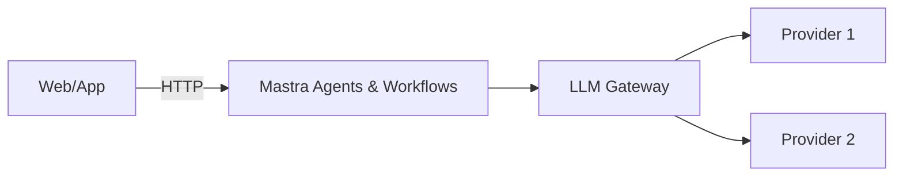
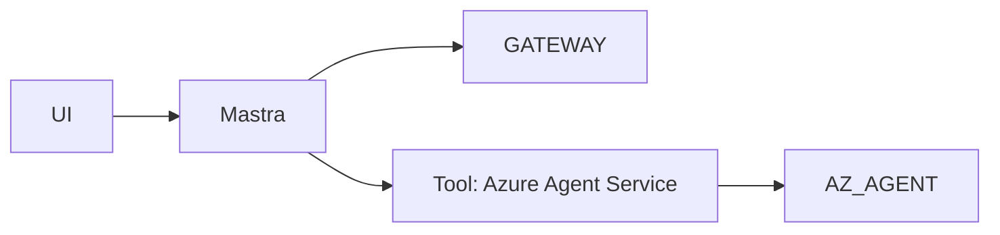

## Two ways to build production AI agents

In recent months many frameworks for building AI agents have emerged. Two approaches I find particularly interesting are:

- **Mastra**, an all-TypeScript agent framework that feels natural if your stack is Node-based.
- **Microsoft Agent Framework + Azure AI Foundry (Azure AI Agents)**, Microsoft's offering that pairs an orchestration library with a managed agent service on Azure.

At first glance they look like different worlds, but they share a similar mental model: agents that keep conversations via threads/sessions, messages, and runs.

<!--truncate-->

---

## 1. Shared mental model: agents, threads and runs

Both Mastra and Microsoft's stack can be understood with the same pattern:

- **Agent**: A virtual “person” with instructions, a model, tools and memory.
- **Thread / Session**: A conversation thread that preserves context.
- **Messages**: Exchanges between `user` and `assistant`.
- **Run**: A specific execution of an agent against a conversation.

The difference is less about concepts and more about where that state machine lives:

- In **Mastra**, the state machine runs in your backend (Node/TS).
- In **Azure AI Agents**, the state machine lives in a **managed Azure service**.

---

## 2. What is Mastra?

In short:

- It's an **agent framework in TypeScript**: agents, tools, workflows (flows/graphs), RAG, tracing and evals (Mastra Cloud).
- The **runtime** runs in your Node app (Express, Next.js, Lambdas, Functions, etc.).
- It integrates well with the JS/TS ecosystem: static typing, nice DX, a CLI and a dev server.

Think of Mastra as an **all-in-one TypeScript-first agent platform**: runtime + agents + tools + workflows + tracing, all expressed in code.

---

## 3. What is Agent Framework + Azure AI Foundry?

In this stack the pieces are split into two complementary parts:

### Microsoft Agent Framework

- A library to **orchestrate agents and workflows** in .NET or Python.
- It lets you define graphs, steps, states, multi-agent scenarios, etc.
- You provide the runtime: App Service, Functions, Container Apps, AKS, and so on.

### Azure AI Foundry / Azure AI Agents

- A managed service that hosts agents (model + instructions + tools + memory), threads (conversations) and runs (executions).
- Consumed via SDKs (`@azure/ai-agents`, `azure-ai-agents`) or REST.
- Deeply integrated with the Foundry ecosystem: model deployments, AI Search, Fabric, Storage, etc.

Together they cover similar functionality to Mastra, but as **two complementary pieces** rather than a single all-in-one package.

---

## 4. High-level comparison

| Aspect | Mastra | Agent Framework + Azure Foundry |
|---|---|---|
| Product type | TypeScript framework + observability (Mastra Cloud) | Orchestration library (.NET/Python) + managed service |
| Primary language | TypeScript / Node | .NET / Python (SDKs available) |
| Where runtime lives | In your backend (Node, Lambdas, Functions, etc.) | In your code + managed Azure agent service |
| Conversation unit | Session / conversationId | Thread |
| Executions | Runs / traces in your app + Mastra Cloud | Runs managed by the agent service |
| Primary models | Any provider supported by Mastra | Models from Azure catalog |
| Tools | JS/TS functions, HTTP, DB, MCP… | Native tools + OpenAPI/HTTP + function tools |
| Lock-in | Low (mostly depends on chosen LLM) | Medium/high (tied to Azure Foundry) |
| Azure integration | Via SDKs / standard APIs | Native (AI Search, Fabric, Storage, Monitor) |
| JS/TS learning curve | Very low | Medium (if also orchestrating with .NET/Python) |

---

## 5. DX: what it is and why it matters

DX = Developer Experience. This includes how easy it is to get started, API clarity, type/autocomplete support, CLI and documentation.

- For Node/TypeScript teams, Mastra's DX tends to feel natural.
- Microsoft's stack offers strong DX for .NET/Python and adds value if you're already deep in Azure, but it also introduces more mental models: Foundry projects, managed agents, Agent Framework, etc.

---

## 6. Pros and cons

### Mastra

#### Pros — Mastra

- TypeScript-first: fits perfectly in modern Node stacks.
- Runtime under your control (`execute`, workflows in TS).
- Multi-provider model support.
- Natural integration with HTTP, DBs, MCP, etc.
- Good DX: CLI, dev server, tracing and evals in Mastra Cloud.

#### Cons — Mastra

- You must operate the infrastructure (Kubernetes, Functions, etc.).
- You handle enterprise governance/compliance yourself.
- No built-in, native Azure integrations by default.

---

### Agent Framework + Azure Foundry

#### Pros — Agent Framework + Foundry

- Managed agent service for threads/runs/state and scaling.
- Native integration with AI Search, Fabric, OneLake, Storage.
- Enterprise security and governance (Entra ID, Monitor, Defender).
- Native tools and OpenAPI/HTTP support.

#### Cons — Agent Framework + Foundry

- Platform lock-in: Foundry and its resources.
- Agent Framework is .NET/Python (no TS runtime like Mastra).
- The runs/threads model may be less flexible than running everything in TS.

---

## 7. Architecture diagrams

### 7.1. Mastra-centric approach



### 7.2. Azure-centric approach

```mermaid
flowchart LR
  UI -->|HTTP| WF[Orchestrator (.NET/Python)]
  WF -->|SDK/REST| AGENT[Azure Agent Service]
  AGENT --> TOOLS[AI Search / Fabric / Storage]
```

### 7.3. Hybrid approach



---

## 8. Quick example: a TS agent delegating to Azure

Hybrid pattern: keep a primary agent in Mastra and give it a tool that calls a managed Azure agent.

```ts
// azureAgentTool.ts
import { AgentsClient } from "@azure/ai-agents";
import { DefaultAzureCredential } from "@azure/identity";

const projectEndpoint = process.env.PROJECT_ENDPOINT!;
const azureAgentId = process.env.AZURE_AGENT_ID!;

const agentsClient = new AgentsClient(
  projectEndpoint,
  new DefaultAzureCredential(),
);

export async function callAzureAgent(input: string): Promise<string> {
  const thread = await agentsClient.threads.create();
  await agentsClient.messages.create(thread.id, "user", input);
  const run = await agentsClient.runs.createAndPoll(thread.id, { agentId: azureAgentId });
  if (run.status !== "succeeded") throw new Error(`Azure agent run failed: ${run.status}`);
  let lastAnswer = "";
  for await (const msg of agentsClient.messages.list(thread.id)) {
    if (msg.role === "assistant") {
      const first = msg.content?.[0];
      if (first && (first as any).text) lastAnswer = (first as any).text;
    }
  }
  return lastAnswer || "The Azure agent did not return a text response.";
}
```

```ts
// hybridAgent.ts (sketch)
import { createAgent } from "mastra";
import { callAzureAgent } from "./azureAgentTool";

export const hybridAgent = createAgent({
  name: "hybrid-agent",
  instructions: "You are an assistant that decides when to delegate queries to Azure.",
  model: { provider: "openai", name: "gpt-4o-mini" },
  tools: {
    askAzure: {
      description: "Use this tool to query the Azure agent",
      execute: async ({ query }: { query: string }) => ({ answer: await callAzureAgent(query) }),
    },
  },
});
```

---

## 9. Key idea: orchestration matters most

Beyond choosing Mastra or Agent Framework + Foundry, the important part is **how you orchestrate your agents around business logic** and **how you manage conversational state**.

Mastra is an all-in-one TypeScript solution; in the Microsoft ecosystem you get Agent Framework (the orchestrator) + Foundry (the managed runtime). Often a hybrid combination delivers the best of both.

---

## 10. Conclusion

- If your team lives in TypeScript, start with Mastra to iterate quickly.
- If your organization requires Azure-level governance and deep integration, use Agent Framework + Foundry.
- Often the most valuable approach is a combination: Mastra for product-layer agility and Foundry for specialist data/governance capabilities.

If you'd like, I can create a short LinkedIn-ready version with the comparison table and the hybrid diagram.

---

## References

- Mastra documentation — [https://mastra.ai/docs](https://mastra.ai/docs)
- Mastra GitHub — [https://github.com/mastra-ai/mastra](https://github.com/mastra-ai/mastra)
- Mastra Book (Principles of Building AI Agents) — [https://mastra.ai/book](https://mastra.ai/book)
- Mastra Templates — [https://mastra.ai/templates](https://mastra.ai/templates)
- Azure AI Foundry (Microsoft Learn) — [https://learn.microsoft.com/en-us/azure/ai-foundry/](https://learn.microsoft.com/en-us/azure/ai-foundry/)
- Azure AI Agents SDK (`@azure/ai-agents`) — [https://www.npmjs.com/package/@azure/ai-agents](https://www.npmjs.com/package/@azure/ai-agents)
- Azure Identity (`@azure/identity`) — [https://www.npmjs.com/package/@azure/identity](https://www.npmjs.com/package/@azure/identity)
- Azure AI & general docs — [https://learn.microsoft.com/azure](https://learn.microsoft.com/azure)

