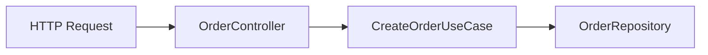

## Arquitectura de cartón piedra: cuando el código parece limpio, pero no hay quien lo entienda

Hay proyectos que, al abrirlos, dan muy buena impresión:

* Carpetas bien puestas: `core`, `domain`, `infrastructure`, `services`, `helpers`…
* Clases con nombres serios: `UserService`, `OrderManager`, `PaymentHandler`…
* Documentación extensa, diagramas, README detallado…

Y sin embargo, cuando intentas seguir **cómo funciona realmente el sistema**, te encuentras con algo muy distinto:
métodos que llaman a otros métodos que llaman a otros métodos, capas que solo delegan, lógica de negocio repartida por todo el repositorio… y tú pensando:

> “Esto parece muy arquitectónico, pero entenderlo es un dolor.”

A eso es a lo que me gusta llamar **arquitectura de cartón piedra**: por fuera parece sólida, pero por dentro no sostiene bien el peso del negocio.

---

## ¿Qué es la “arquitectura de cartón piedra”?

No es un término oficial, pero describe muy bien una situación bastante común:

> **Arquitectura de cartón piedra**: cuando se construye una estructura de carpetas y capas que *simula* una arquitectura limpia, pero en la práctica no ayuda a entender el flujo ni a mantener el sistema.

Algunos síntomas típicos:

* Abres el proyecto y ves mil capas, pero **no sabes dónde vive el negocio**.
* Para seguir un caso de uso sencillo (por ejemplo, crear un pedido) tienes que abrir **8–10 ficheros**.
* La mayoría de las clases son **pasamanos**:

  * `Controller` → `Manager` → `Handler` → `Service` → `Processor` → `Repository`…
    y cada uno solo delega al siguiente.
* La lógica de negocio está **fragmentada**:

  * un trozo en el controller,
  * otro en un helper,
  * otro en el repositorio,
  * otro en un “util” genérico.

Puede haber documentación muy buena…
pero si la estructura del código no refleja bien el negocio, **la arquitectura no está cumpliendo su función**.

---

## ¿Por qué pasa esto?

Normalmente se mezclan varias cosas:

1. **Diseñar por carpeta, no por dominio**
   Se copia una estructura “de libro” (o de otro proyecto) sin pensar si encaja con el negocio real.

2. **Confundir “más capas” con “mejor arquitectura”**

   * Se añaden capas tipo `Manager`, `Handler`, `Processor`, etc.
   * Pero muchas veces esas capas no encapsulan nada nuevo, solo complican el recorrido.

3. **Cargo cult de patrones**
   Se aplican etiquetas como “Clean Architecture”, “DDD”, “Hexagonal”…
   pero solo en lo superficial: nombres de carpetas y clases, sin respetar los principios.

4. **Miedo a equivocarse**
   Se crean capas “por si acaso las necesitamos luego”,
   y al final se acumulan niveles de indirección innecesarios.

---


## Cómo se vive trabajar en un proyecto así

Si has caído en uno de estos proyectos, probablemente te suena:

* Para hacer un cambio pequeño tienes que tocar código en **medio repositorio**.
* No está claro dónde **debería** ir una nueva regla de negocio.
* Refactorizar da miedo porque no entiendes bien el flujo completo.
* La documentación se vuelve obligatoria porque el código, por sí solo, **no se explica**.

Una arquitectura sana debería ser casi lo contrario:

> Aunque no haya documentación perfecta,
> deberías intuir dónde están las cosas con solo ver la estructura básica.

---

## ¿Cómo es una arquitectura que ayuda de verdad?

Una buena arquitectura no va de tener muchas capas, sino de que:

### 1. El flujo sea fácil de seguir

Ejemplo muy simple:

```text
HTTP Request → Controller → Caso de uso → Repositorios/Adaptadores → Respuesta
```

Es decir, puedes explicar qué pasa con una frase y unos pocos ficheros.

### 2. La lógica de negocio esté concentrada en sitios previsibles

Por ejemplo:

* `CreateOrderUseCase`
* `ReserveSeatService`
* `CalculatePriceDomainService`

Y no escondida en helpers genéricos o en métodos random de un repositorio.

### 3. Las capas existan por una razón clara

Un esquema típico (y suficiente en muchos casos) podría ser:

* **Interface / API**: controllers, DTOs, validaciones de entrada.
* **Application**: casos de uso, orquestación de procesos.
* **Domain**: entidades, reglas de negocio puras.
* **Infrastructure**: repositorios, acceso a bases de datos, APIs externas, colas, etc.

La clave es que, si alguien te pregunta:

> “¿Dónde está la lógica de *reservar un curso*?”

puedas responder algo tipo:

> “Mira en `application/ReserveCourse.ts` y en `domain/CourseReservation`.”

Sin tener que hacer un *“buscar en todo el repo”*.

---

## Checklist rápido: ¿huele a cartón piedra?

Algunas preguntas útiles cuando revisas un proyecto:

1. **¿Cuántos ficheros tengo que abrir para seguir un caso de uso sencillo?**

   * Si son más de 5–6, sospecha.
2. **¿Cuántas clases solo delegan sin añadir lógica nueva?**

   * Si la mayoría son “pasamanos”, sobran capas.
3. **¿Sé claramente dónde vive el negocio?**

   * ¿Hay un sitio claro para los casos de uso?
4. **¿La estructura está basada en “features” o en “capas genéricas”?**

   * `orders/`, `payments/`, `users/` suele ser más útil que
     `managers/`, `helpers/`, `processors/`.
5. **¿Qué pasa si el “desarrollador héroe” no está?**

   * ¿El equipo puede mantener el sistema sin él/ella?

Cuantas más respuestas incómodas, más probable que estés delante de una arquitectura de cartón piedra.

---

## Cómo mejorar sin reescribirlo todo

No siempre puedes tirar el proyecto y empezar de cero (de hecho, casi nunca).
Pero sí puedes **mejorar poco a poco**:

### 1. Elegir un caso de uso clave y mapearlo

Por ejemplo: “crear pedido”.

* Dibuja el flujo actual (aunque sea en un papel) desde el endpoint hasta la base de datos.
* Identifica capas que no aportan nada.

### 2. Concentrar la lógica de negocio

* Crea un `CreateOrderUseCase` o similar.
* Ve moviendo reglas dispersas (en controller, helpers, etc.) hacia ese caso de uso.

### 3. Eliminar pasamanos innecesarios

* Si un `Manager` solo llama a un `Service` sin añadir nada, fusiónalos.
* Menos capas, más claridad.

### 4. Nombrar por dominio, no por patrón

Mejor:

* `AssignSeatToPassenger`
* `CalculateInvoiceTotals`

que:

* `SeatManager`
* `InvoiceProcessor`

### 5. Documentar el flujo, no solo la arquitectura

Un diagrama sencillo del tipo:



vale oro si realmente refleja lo que pasa.

---

## Cerrar el círculo

Al final, la reflexión es sencilla:

* **Arquitectura no es cuántas carpetas tienes**,
  sino cuánto te ayuda a pensar y cambiar el negocio.
* Documentar está genial, pero la mejor documentación es un código y una estructura
  que “se explican solos”.
* Y un desarrollador realmente senior no es solo el que desarrolla rápido,
  sino el que deja un sistema que cualquier persona del equipo puede entender y seguir ampliando.

Si al abrir un proyecto tienes la sensación de que todo está muy “bonito”, pero **no puedes seguir el flujo sin sufrir**, probablemente no eres tú: es cartón piedra.

Y la buena noticia es que, en cuanto empiezas a desarrollar ese olfato, también empiezas a diseñar tus propios proyectos de forma distinta: menos postureo, más claridad, más negocio… y menos dolor para el siguiente que venga detrás (aunque ese siguiente seas tú dentro de seis meses).

---

Si quieres, en otro post podemos hacer el “modo práctico”: coger un caso de uso real tuyo y enseñar un *antes vs después* de refactor, con código.
