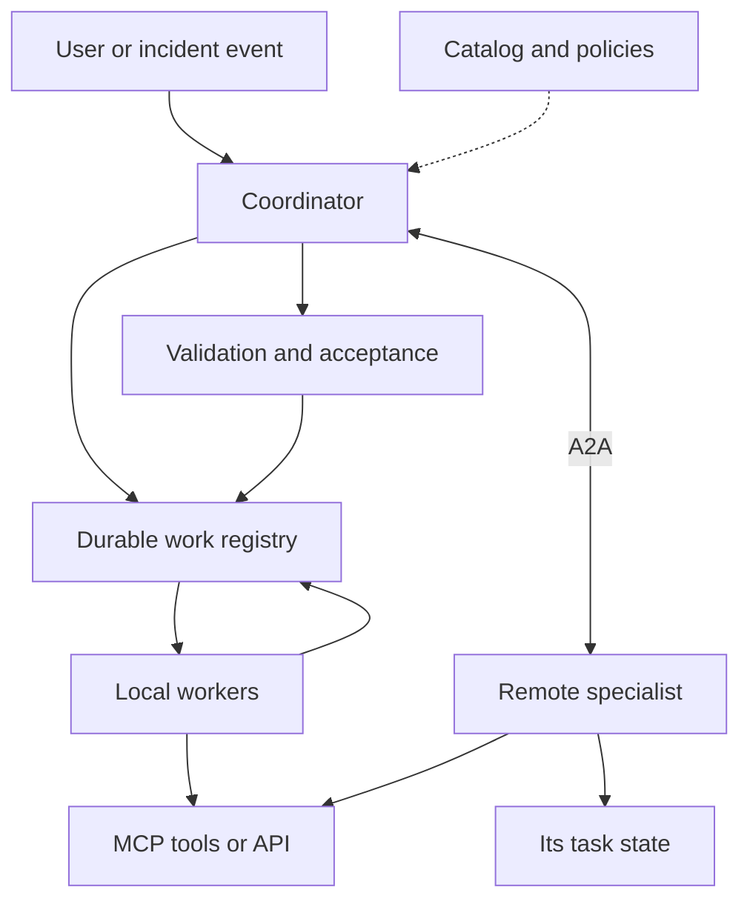
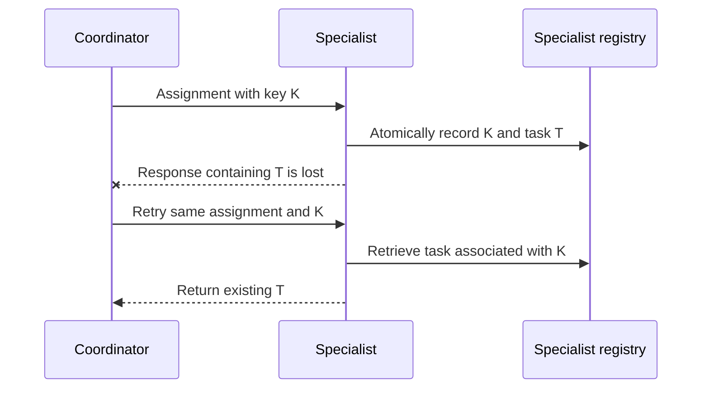

I want to start automating things with agents and reuse them across projects. An agent that investigates incidents, another that examines repositories, another that prepares documentation. And I want them to collaborate when the work calls for it.

The supply of frameworks is growing so quickly that choosing one seems to have become the mandatory first step. My question starts earlier: **how do you design an agent that others can find, assign work to and hold accountable for its results?**

That leads me to services, contracts and distributed systems. The framework running each agent will be a decision within that architecture.

<!--truncate-->

This article brings together protocol documentation, engineering patterns and research. Sources were consulted on **September 5, 2026**. The architecture and experiment I propose are a starting point for studying the problem; they do not yet represent an implementation or measured results.

## 1. The unit I want to reuse

For this discussion, I consider an agent a component that can pursue an objective, choose actions within limits and check its progress. Publishing it as a service adds other obligations: accepting an assignment, maintaining an identity and returning a result under a recognizable contract.

It helps to distinguish three things we often simply call an "agent":

| Concept | What it represents | Example |
| --- | --- | --- |
| Definition | Capability, instructions, permitted tools and version | Incident investigator v2 |
| Execution | A particular attempt to perform work | Investigate incident INC-42 |
| Service | The interface through which others access that capability | Endpoint that accepts investigations and exposes their status |

Having a hundred definitions does not require a hundred running processes. Several workers can execute assignments on demand. Conversely, one published service might coordinate several agents internally.

My criterion for separating them would be responsibility: different data, permissions, owners or a specialization that can be evaluated independently. Giving a prompt's character a different name does not establish a need for another service.

## 2. These decisions belong to different layers

| Layer | Question it must answer |
| --- | --- |
| Interoperability | How are capabilities described and messages, tasks and results exchanged? |
| Domain contract | What does investigating an incident mean, and what makes a diagnosis acceptable? |
| Coordination | Who chooses collaborators, divides the work and decides the next step? |
| Execution | Where does the work run, and how does it continue after a crash? |
| Control | Who can request what, using which data, budget and audit trail? |

A shared protocol helps participants understand a message's structure. The meaning of "complete diagnosis" still requires agreement between them.

I would therefore evaluate interoperability at three levels: **protocol compatibility, contract compatibility and authorization to collaborate**. Valid JSON only solves part of the problem.

## 3. What MCP and A2A provide

### MCP: capabilities available to an AI application

MCP organizes communication between a host, its clients and servers exposing tools, resources and prompts. It lets an AI application incorporate external capabilities through a common interface. [MCP architecture](https://modelcontextprotocol.io/docs/2026-07-28/learn/architecture).

In our example, an agent could query logs through an MCP tool. That server might itself run a model: the implementation behind the tool does not, by itself, determine its public contract.

MCP also supports prolonged operations through the Tasks extension, which requires explicit support from both client and server. The distinction "MCP is synchronous and A2A is asynchronous" is insufficient. [MCP Tasks](https://modelcontextprotocol.io/extensions/tasks/overview).

### A2A: interacting with a remote agent

A2A describes agents through an Agent Card and defines messages, tasks and artifacts. A consumer can assign work without accessing the remote agent's tools or internal state. [A2A concepts](https://a2a-protocol.org/latest/topics/key-concepts/).

An interaction can return an immediate message or create a task with progress tracking and requests for additional information. A2A does not require every exchange to become a lengthy job either. [Life of a task](https://a2a-protocol.org/latest/topics/life-of-a-task/).

The distinction I would use when designing is:

| Assignment | Contract I care about |
| --- | --- |
| "Query this service's errors between these timestamps" | An operation with defined inputs and output; MCP or an API may fit |
| "Investigate this incident and deliver a diagnosis supported by evidence" | Delegation of an objective with progress tracking; A2A may fit |

These are design examples, not an absolute boundary. I would publish a capability according to the responsibility I want to offer consumers. And I would establish compatible versions and capabilities before connecting implementations: sharing a protocol acronym does not guarantee that two particular clients work together.

## 4. Patterns for deciding who does what

Anthropic documents chaining, routing, parallelism, coordination with workers and evaluation loops. Microsoft also describes handoff, group conversation and planning with a coordinator. These are design references that can be studied without adopting their frameworks. [Anthropic patterns](https://www.anthropic.com/engineering/building-effective-agents), [Microsoft patterns](https://learn.microsoft.com/en-us/azure/architecture/ai-ml/guide/ai-agent-design-patterns).

This is my practical interpretation of the alternatives:

| Pattern | Work allocation | Decision I would make explicit |
| --- | --- | --- |
| Routing | Select a specialist | What happens when no candidate fits |
| Sequence | Each stage receives the preceding result | When to stop an invalid output from advancing |
| Supervisor and specialists | One owner delegates and assembles results | Who remains responsible for the original assignment |
| Parallelism and aggregation | Several branches work and are combined | How to handle partial or contradictory results |
| Handoff | Another agent takes over the interaction | When the transfer is considered accepted |
| Producer and evaluator | A proposal receives a review | Acceptance criteria and a revision limit |
| Event choreography | Participants react to facts | Who checks that the overall objective was completed |
| Blackboard | Participants use a common information space | Ownership, versions and writing rules |
| Negotiated selection | Candidates propose terms | How to assess capability, cost and commitments |

The last three also help us consider less centralized collaboration. I include them here as architectural alternatives; this table is not an official taxonomy shared by the providers.

### Delegating a part and transferring control

If a coordinator asks a specialist for a log analysis, it expects to receive and integrate it. If it transfers the conversation to database support, responsibility for leading the next step changes. Using the same internal call mechanism does not remove that distinction.

### Parallel work and debate

Two investigators can examine different sources and deliver evidence. If they must also discuss their findings to reach agreement, another cost appears: communication rounds, shared context and a stopping criterion.

For INC-42, I would begin with logs and recent changes in parallel, followed by integration. I would introduce debate only after identifying contradictions that the interaction could help resolve.

### Coordinating through events

`InvestigateIncident` is a command; `EvidenceCollected` expresses a fact. I would preserve that distinction in the contracts so it is clear who must act and what has happened.

Choreography can help when several automations react to the same fact. I would still retain an owner for INC-42's outcome: the existence of events does not establish that someone finished the diagnosis.

## 5. Making agents available

A2A supports discovery through a known address, direct configuration or catalogs. Its conventional Agent Card path is `/.well-known/agent-card.json`; the specification does not prescribe a universal catalog API. Knowing that path does not itself discover the domains hosting agents. [A2A discovery](https://a2a-protocol.org/latest/topics/agent-discovery/).

For an initial private network, I would use a small, curated catalog. Alongside the protocol description, I would store operational data of my own:

- Owner, contract version and access scope.
- Accepted capabilities and examples of valid inputs.
- Evaluations by task type, with a date and the evaluated version.
- Operational status, concurrency limits and terms of use.

Selection would have two steps. First, code filters by permissions, compatibility and availability. Then rules or a model choose among the valid candidates.

I would avoid putting the entire catalog into every prompt. For "investigate an incident in project X," the coordinator should receive the few candidates authorized for that work.

I would also separate the relatively stable service description from its current health. "I can analyze logs" and "I can accept work now" are different facts. A card, even when authenticated, establishes provenance; quality requires evaluations.

## 6. The delegation contract

This is where I most want to go deeper. Asking another agent to investigate transfers some decision-making capacity. I need to bound it.

This would be an **illustrative application document**, with fictional identifiers. It is not an Agent Card or an A2A message ready to send:

```json
{
  "contract": "incident-investigation/v1",
  "work_id": "work-42",
  "parent_work_id": "incident-42",
  "objective": "Explain the errors in the checkout service",
  "inputs": {
    "project": "shop-demo",
    "incident_ref": "incident:INC-42",
    "evidence_refs": ["evidence:logs-42", "evidence:deployments-42"]
  },
  "acceptance": [
    "Every conclusion references evidence",
    "Distinguish facts, hypotheses and missing data"
  ],
  "authority": {
    "policy_ref": "policy:incident-read-only",
    "allowed_actions": ["logs.read", "deployments.read"]
  },
  "limits": {
    "deadline": "2026-09-05T12:10:00Z",
    "max_model_calls": 12,
    "max_delegation_depth": 1
  },
  "result_contract": "incident-diagnosis/v1",
  "idempotency_key": "shop-demo:INC-42:investigation:1"
}
```

The output contract would define at least findings, evidence references, uncertainties and recommendations. Input references would resolve versioned data, including the incident's time window.

To transport this over A2A, both parties would need to agree on its structured data representation and version. The business work identifier and the remote task identifier must be linked, even if they differ.

Authority and limit fields express conditions; **writing them in JSON does not enforce them**. The service validates identity and the applicable policy, restricts tools and records consumption. A client cannot grant itself permissions by editing `allowed_actions`.

I would also define who accepts the result: the coordinator checks structure and evidence; a person participates when a subsequent decision requires approval. Investigation permissions do not automatically authorize a repair.

## 7. An initial architecture we can test

For the incident case, I would propose these responsibilities:



This is my own proposal. The boxes represent responsibilities and can share an application or database in an initial implementation.

The local registry retains the assignment, its dependencies and references to remote tasks. Each remote service retains the state it exposes through its contract. That lets me query an investigation after restarting the coordinator without needing access to the specialist's database.

A durable queue is a familiar option for distributing work among workers. I could also begin with a job table whose entries are claimed atomically, using a temporary lease so work can be recovered if a worker disappears. The choice depends on concurrency and the guarantees needed. [Competing Consumers pattern](https://learn.microsoft.com/en-us/azure/architecture/patterns/competing-consumers).

The first flow would be concrete: receive INC-42, authorize it, collect logs and deployments, integrate the evidence and validate the diagnosis. Model-based planning would enter only where the next step actually depends on what is discovered.

## 8. What happens when execution goes wrong

### A timeout leaves uncertainty

Suppose the specialist accepts the assignment and its response is lost. The coordinator does not know whether the operation arrived. Simply repeating it could create two investigations or duplicate an external effect.

A2A allows send operations to be idempotent but does not impose that guarantee on every agent. The deduplication policy therefore needs to be agreed and verified. [A2A idempotency semantics](https://a2a-protocol.org/latest/specification/#331-idempotency).

My contract would require reusing a key for the same logical operation, rejecting reuse with different content and allowing recovery of the associated task. When the remote service cannot provide that guarantee, the coordinator must preserve the uncertainty and reconcile state before repeating an action with effects.



This diagram represents an additional guarantee agreed within my application. For an external effect, deduplication must also reach the system performing that effect. Recording a key in the coordinator does not guarantee exactly-once execution across the whole system.

### Cancellation and recovery need rules

I would define whether canceling a parent cancels its subtasks, what happens when a remote service does not respond and how to record a result that arrives late. Canceling an execution does not automatically undo an action already performed.

I would distinguish execution attempts from the business assignment. In A2A, a terminal task cannot restart: new related work requires another task. The local registry can retain the relationship between them. [A2A task immutability](https://a2a-protocol.org/latest/topics/life-of-a-task/).

Budgets must also be shared. If the parent authorizes twelve calls, children receive portions of that limit; assigning twelve to each multiplies the budget. I would reserve capacity before launching parallel branches.

And I would keep two states separate: execution finished and result accepted. A diagnosis may arrive successfully while lacking sufficient evidence. It should remain rejected or awaiting review, instead of becoming a certainty because the task finished.

## 9. Context, memory and authority

For this architecture, I would distinguish conversation history, execution state, evidence and reusable memory. Each has different lifetimes and permissions.

When delegating, I would send an objective, a bounded summary and authorized references. Each finding would retain its source, timestamp and version. If two investigators disagree, I would keep both observations until the contradiction is resolved; overwriting one with the other loses information.

A blackboard could provide that shared space for evidence and hypotheses. It does not need to start as a vector database: it needs rules for access, provenance and updates.

For identity, I would distinguish the user requesting work, the calling service and the authorized operation. MCP's security documentation specifically warns against accepting and forwarding tokens intended for other services. Chaining agents does not make a credential universal. [MCP security](https://modelcontextprotocol.io/docs/2026-07-28/tutorials/security/security_best_practices).

My operational rule would be that each delegation preserves or reduces the available authority. Documents, logs and responses from other agents are treated as potentially untrusted data: their content cannot modify the executor's policies. A message suggesting "restart production" still needs valid authorization for that operation.

## 10. What research is studying

Three references help turn these decisions into testable questions:

| Work | Type of evidence | What it contributes and what it does not establish |
| --- | --- | --- |
| [Towards a Science of Scaling Agent Systems](https://research.google/blog/towards-a-science-of-scaling-agent-systems-when-and-why-agent-systems-work/) | Evaluation of 180 configurations | Finds benefits in parallelizable tasks and degradation in certain sequential ones. Results depend on tasks, models and configurations; they do not establish a universal agent count. |
| [Why Do Multi-Agent LLM Systems Fail?](https://arxiv.org/abs/2503.13657) | Failure analysis and the MAST taxonomy | Distinguishes design problems, misalignment between agents and verification. Helps classify errors; it is not a recipe guaranteed to eliminate them. |
| [Intelligent AI Delegation](https://arxiv.org/abs/2602.11865) | Conceptual proposal for delegation | Incorporates authority, responsibility, boundaries and trust into work allocation. It is research, not an approved protocol or an architecture validated for every business. |

From these readings I draw my own experimental agenda: selecting collaborators using evidence, adapting coordination to the task and independently validating results. This is my interpretation of how to study the system, not a joint conclusion published by those authors.

Review deserves particular attention. Two agents may share a model, sources and assumptions, and agree on an error. To check a claim about INC-42, I would prefer to compare it with the original logs and verifiable rules. Adding a second opinion may help, but its usefulness also needs measurement.

## 11. The experiment I would start with

I would prepare a collection of anonymized historical or synthetic incidents, with frozen evidence and evaluation criteria established before running the tests. I would include cases with insufficient information, so the system can succeed by recognizing that it does not yet know.

I would compare these variants:

1. One agent with the necessary tools.
2. A coordinator with two specialists: logs and recent changes.
3. The same collaboration with an additional diagnosis evaluator.

I would keep access to sources identical and total limits comparable, record model versions and repeat the cases. I would measure diagnoses supported by evidence, incorrect claims, cost per accepted result, latency and the need for human intervention.

I would also inject failures: lose a response after acceptance, restart a worker, duplicate a delivery, cancel during execution and supply contradictory evidence. That exercise checks properties a happy-path demonstration leaves unexplored.

I would add another agent when results showed a useful improvement or when I needed a real responsibility boundary. I would publish its capabilities, contract and terms of use alongside observed limitations.

What I want to build is a collection of reusable capabilities: assign them work, follow it through failures and use evidence to decide whether a result deserves acceptance. From there, it makes sense to start creating agents in quantity.
