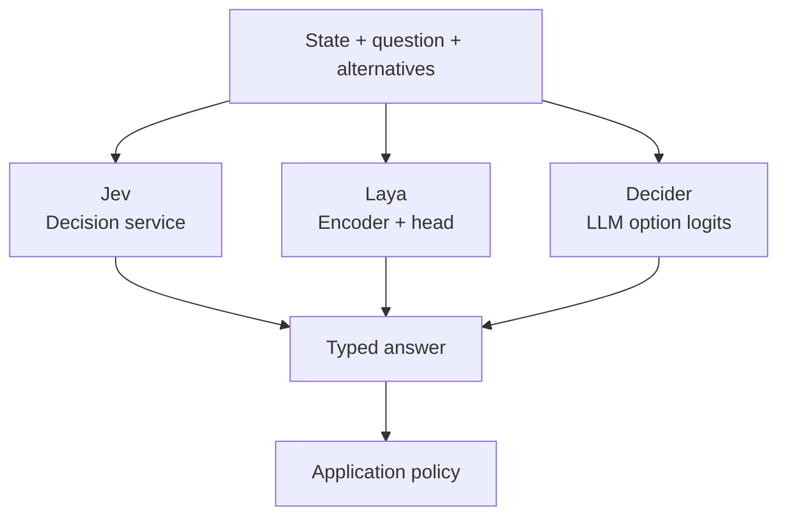
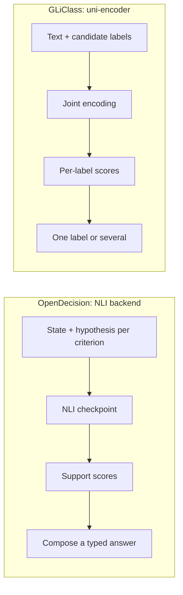
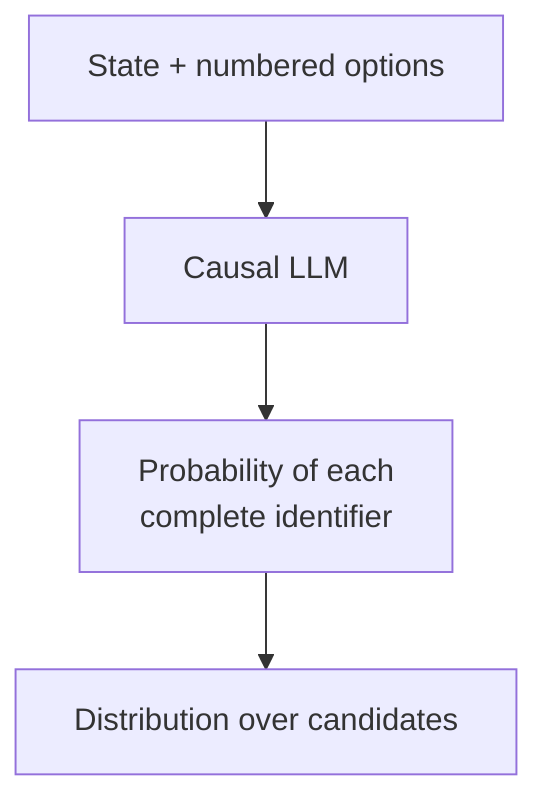
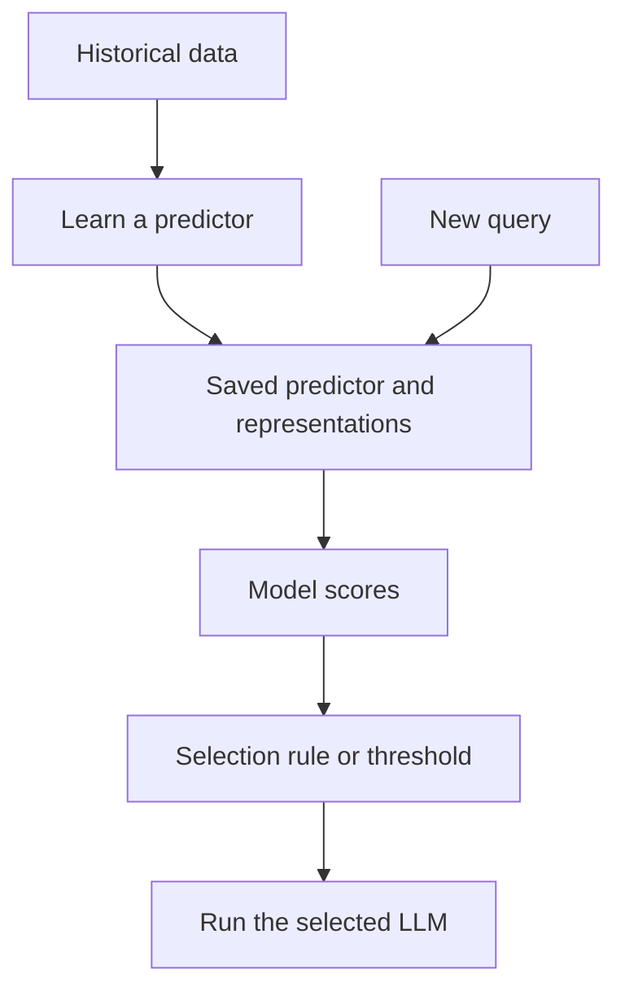
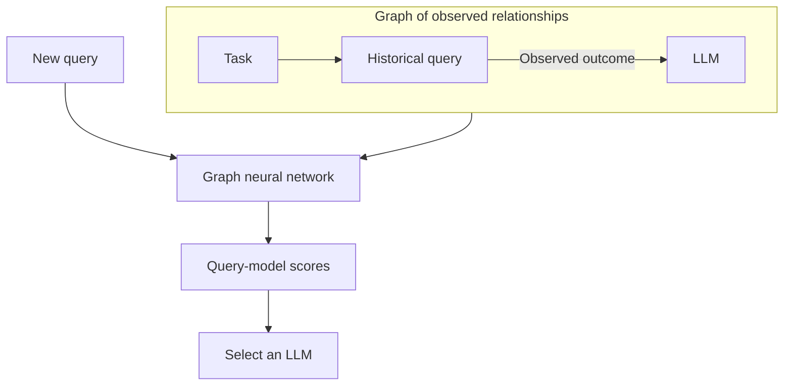
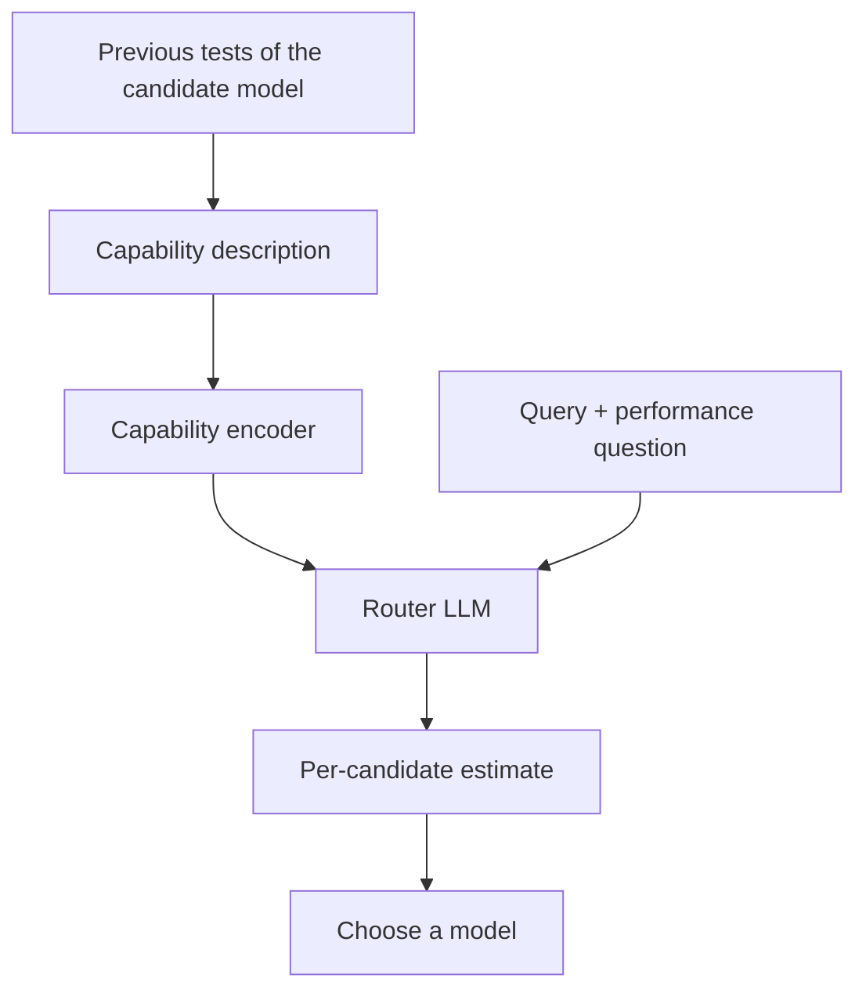
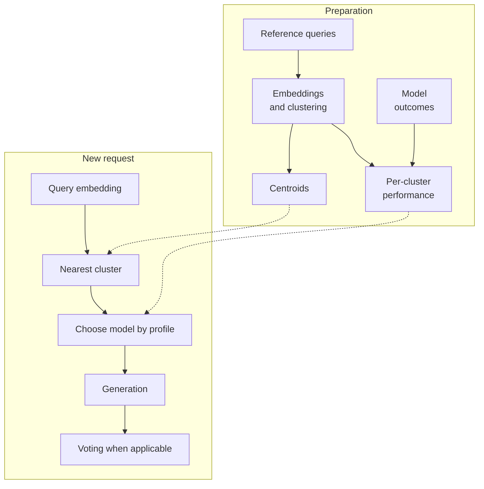
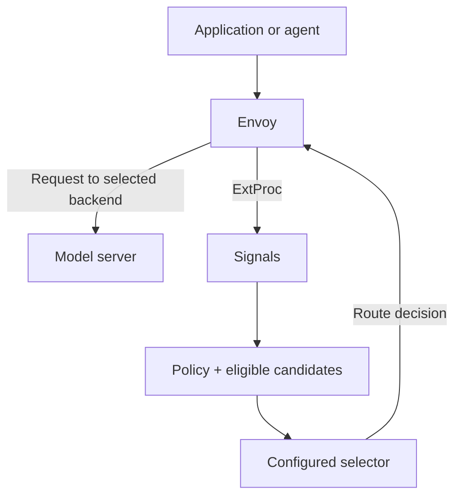
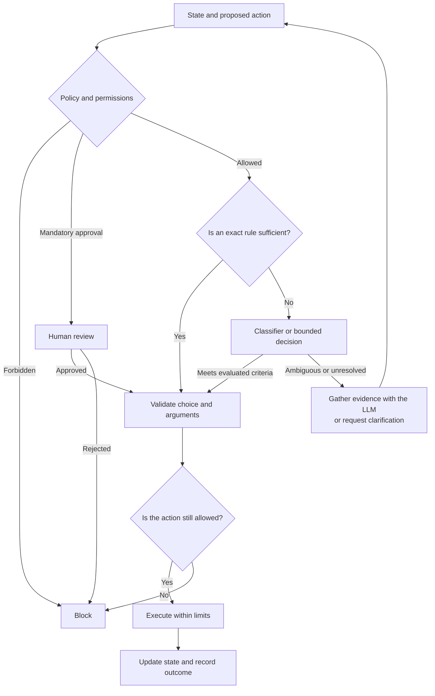

I have been investigating which decisions in a coding agent deserve a generative call and which can use a smaller mechanism. Choosing a tool, checking a claim and escalating a task are different problems from writing the patch that solves it. My proposal is to distribute that work across code, classifiers, decision models and LLMs, then measure whether the separation improves the outcome.

<!--truncate-->

## Classifying, deciding and reasoning

**Classification** assigns labels: `bug`, `documentation` or `possible_injection`. **Decision** incorporates objectives and constraints to choose an action: read a file, ask for context or escalate to another model. **Reasoning** builds an explanation, diagnosis or plan from evidence.

These functions can work together. A classifier can provide the signal for a decision; policy determines what to do with it. A closed answer set can also require reasoning: answering “yes” to a difficult mathematical question does not make the task easy.

I therefore distinguish two questions: **what output does the software need**, and **what capability is required to obtain it**. A typed contract describes the first; task evaluation must answer the second.

## When avoiding another generation pays off

If a harness calls its main LLM to plan, then makes another call only to choose between `search`, `read_file` and `run_tests`, it adds context processing, generation and response validation. Structured output can reduce formatting errors. Inference costs and semantic errors remain.

An encoder or dedicated model can score options without producing free-form text. That may reduce latency and cost, particularly for repeated decisions. The measurement also needs to include networking, model loading, context length, retries and recovery from bad decisions.

Before adding a model, I would check whether code is enough: a denied permission, exit code or budget limit needs no inference. I would also distinguish a new decision from tool calling the LLM already produces during its turn: adding a classifier on top of every existing call may duplicate work.

## The map: similar outputs, different techniques

The table summarises the documented mechanism. Sharing an API does not establish a shared architecture or quality. The figures below are explanatory schematics for this article; they are not benchmark results.

| Project | Technique or contract | Source of the signal |
| --- | --- | --- |
| [Jev](https://docs.typesafe.ai/introduction) | Typed-decision API; internal architecture not detailed here | State, questions and explicit options |
| [Laya](https://github.com/NandhaKishorM/laya) | Encoder with a decision head | State and option representations; training and calibration |
| [Mapika Decider](https://github.com/Mapika/decider) | LLM variants with option-logit readout | Probabilities restricted to valid answers |
| [GLiClass](https://arxiv.org/abs/2508.07662) | Zero-shot classification; primary uni-encoder variant | Jointly processed text and labels |
| [OpenDecision / ModernBERT](https://deepanwadhwa.github.io/OpenDecision/model-selection/) | NLI checkpoint adapted to typed decisions | Support for hypotheses constructed from criteria |
| [LLM2Jev](https://arxiv.org/abs/2610.02076) | Probability readout over numeric identifiers | An existing LLM, with training-free or fine-tuned recipes |
| [RouteLLM](https://arxiv.org/abs/2406.18665) | Family of preference routers | Comparisons between models' responses |
| [RouterDC](https://arxiv.org/abs/2409.19886) | Dual contrastive learning | Per-query performance and query grouping |
| [EmbedLLM](https://arxiv.org/abs/2410.02223) | Compact model representations | Model-by-question correctness matrix |
| [GraphRouter](https://arxiv.org/abs/2410.03834) | Heterogeneous graph and edge prediction | Relationships between tasks, queries and LLMs |
| [Model-SAT](https://arxiv.org/abs/2502.17282) | Capability profiles and capability instruction tuning | Each model's aptitude-test results |
| [The Avengers](https://arxiv.org/abs/2505.19797) | Clustering, performance profiles and voting | Previous evaluation per query group |
| [vLLM Semantic Router](https://github.com/vllm-project/semantic-router) | Signals, policy and selection layer | Classifiers, configuration and the selected algorithm |

### 1. Jev, Laya and Decider: the typed contract

Jev's public contract distinguishes `Choice`, `Score` and `Noul`: selecting an option, placing content on a described scale, and returning a yes probability. That contract can suit several internal mechanisms; API documentation does not establish that Jev uses the same encoder or head as another project.

*Figure 1. A similar contract can wrap different implementations. Jev appears as a service, without an invented internal architecture.*

Laya uses encoders: ModernBERT in English checkpoints and mmBERT in the multilingual one. Qwen-based Decider variants read logits at answer positions and normalise them over valid options. Both require identifying the checkpoint, runtime and calibration when comparing outcomes. Sources: [Laya](https://github.com/NandhaKishorM/laya) and [Decider's mechanism](https://github.com/Mapika/decider#how-it-works).

Here, `Decider` refers to Mapika. [Strands Decider](https://github.com/strands-labs/strands-decider) is a separate project; distinguish them when comparing implementations.

### 2. GLiClass and OpenDecision: two classification paths

GLiClass's uni-encoder variant processes labels and text together, then computes per-label scores. Multiple labels can be activated in multi-label classification; a single winner should not always be forced. The project also considers other variants. Sources: [paper](https://arxiv.org/abs/2508.07662) and [code](https://github.com/Knowledgator/GLiClass).

OpenDecision defaults to `MoritzLaurer/ModernBERT-large-zeroshot-v2.0`. It turns criteria into NLI queries: whether the state supports a hypothesis. Its wrapper can reformulate and repeat queries; avoiding free-form generation does not guarantee resolving a whole decision in one forward pass. Source: [backend selection and evaluation](https://deepanwadhwa.github.io/OpenDecision/model-selection/).

*Figure 2. Classifying text with labels and evaluating support hypotheses are related operations with different formulations.*

**ModernBERT is an encoder family**, not a decision API or a zero-shot classifier ready for any task. The capability depends on the checkpoint and its adaptation. Likewise, *zero-shot* means using new labels or tasks without specific examples in that call; the model has still been trained. Source: [ModernBERT paper](https://aclanthology.org/2025.acl-long.127/).

### 3. LLM2Jev: using an LLM as an option reader

This preprint scores identifier continuations such as `1]` or `10]` from a shared prefix. It combines token probabilities to compare complete candidates; examining only the first token is insufficient when two identifiers share it. It proposes both a training-free recipe and fine-tuning. Source: [LLM2Jev](https://arxiv.org/abs/2610.02076).

*Figure 3. Readout is restricted to candidate continuations; cost also depends on their tokenisation.*

With access to model probabilities, this technique can reuse a model for decisions. A chat API does not always expose what it needs. Sharing weights does not eliminate context processing or guarantee savings: measure the implementation you use.

### 4. RouteLLM, RouterDC and EmbedLLM: learning model scores

These projects require previous evidence about models and queries. When routing a new request, the predictor estimates scores without first requesting a complete answer from every candidate generator.

*Figure 4. Router preparation and per-request execution are separate; the learning methods differ.*

**RouteLLM** compares response preferences and offers several routers. Matrix factorisation is one variant, alongside classifiers and similarity-weighted ranking. A threshold controls when to use the stronger model. Sources: [paper](https://arxiv.org/abs/2406.18665) and [repository](https://github.com/lm-sys/RouteLLM).

**RouterDC** learns a query encoder and model embeddings with two contrastive objectives: query–LLM and query–query. The first brings queries closer to models that performed well; the second organises queries by their groups. Sources: [paper](https://arxiv.org/abs/2409.19886) and [code](https://github.com/shuhao02/RouterDC).

**EmbedLLM** learns compact representations from a model-by-question correctness matrix. These representations then support performance prediction and model selection. Its vectors are learned representations of behaviour, rather than simply an embedding of an LLM's commercial name. Sources: [paper](https://arxiv.org/abs/2410.02223) and [code](https://github.com/richardzhuang0412/EmbedLLM).

### 5. GraphRouter: learning graph relationships

GraphRouter introduces task, query and LLM nodes. A graph neural network uses observed relationships and estimates query–model edge scores, accounting for performance and cost. Sources: [paper](https://arxiv.org/abs/2410.03834) and [public implementation](https://github.com/ulab-uiuc/GraphRouter).

*Figure 5. A conceptual graph and predictor; an observed edge does not imply executing that model for every new query.*

### 6. Model-SAT: building a capability profile

Model-SAT obtains capability descriptions from aptitude tests, encodes them, and combines them with the query in a small LLM to predict whether a candidate can solve it. It requires router training and previous candidate evaluation; a handwritten “good at coding” description does not reproduce the method. Source: [paper](https://arxiv.org/abs/2502.17282).

*Figure 6. Capabilities are measured first; the selected generator resolves the request afterwards.*

The paper links a code repository, but I could not verify its contents during this review. This description of the mechanism relies on the paper.

### 7. The Avengers: grouping queries and measuring specialists

Avengers prepares query clusters and performance profiles per model and cluster. A new request is assigned to the nearest group, then a model is selected using its profile. It can add repeated sampling and voting. It avoids training another neural router, but needs evaluated data to construct the profiles. Sources: [paper](https://arxiv.org/abs/2505.19797) and [code](https://github.com/ZhangYiqun018/Avengers).

*Figure 7. Previous work makes runtime selection straightforward.*

Voting needs comparable answers. In coding, several matching texts or patches do not establish correctness: validate them against task criteria and executable checks. The paper also distinguishes its treatment of code tasks.

### 8. vLLM Semantic Router: signals, policies and serving

vLLM Semantic Router combines signal detection, policies, eligible candidates and selection algorithms. Envoy handles traffic and backends generate responses. The actual technique depends on the configured selector and models; there is no single “vLLM Semantic Router model” whose quality summarises the system. Source: [project architecture](https://github.com/vllm-project/semantic-router/blob/main/website/docs/overview/semantic-router-overview.md).

*Figure 8. Semantic decisions and traffic transport have separate responsibilities.*

The client still owns its state and tool execution. Filtering a catalogue neither executes tools nor grants permissions.

## Where each technique fits in a coding agent

| Use | Concrete example | Mechanism I would evaluate |
| --- | --- | --- |
| Tool selection | Reduce a large catalogue to relevant tools | Semantic retrieval or GLiClass; typed decision for final selection |
| Guardrails | Flag suspicious instructions in a retrieved file | Specialist classifier; policy and permissions in code |
| Escalation | Ask for context or change capability tier | Choice/Noul with an abstention alternative |
| Cheap judge | Check whether the agent's explanation is supported by the diff and tool output | NLI or a typed question with bounded evidence |
| Next action | Choose whether to inspect, test, fix or finish | Typed decision over state and eligible actions |
| Model routing | Select the generator for the next turn | Router with your own outcome data and cost/capability constraints |

This table proposes applications to evaluate; it does not claim that each project has demonstrated every use in coding agents.

For a **cheap judge**, reading an exit code or detecting a protected path should remain deterministic code. A model adds value when semantic interpretation is needed, such as checking whether evidence supports a summary claim. Its acceptance does not replace running tests or reviewing the change.

For an **action controller**, the harness must offer relevant choices, preserve state and bound retries. A typed decision over a stale menu can loop. A new plan or unfamiliar race condition requires the agent to gather evidence and reformulate the problem.

For **model routing**, perceived difficulty and actual performance are different signals. Calling a task “complex” does not establish which model will solve it better. Changing providers during a loop can also affect tool schemas, conversation state or caches; validate agent continuity.

## The architecture I would start building

I would keep authorisation and execution inside the runtime. First resolve exact rules and deterministic decisions, then use inference for remaining semantic questions. Mandatory human review must apply even when the model returns a high score.

*Figure 9. A model signal cannot bypass authorisation rules; the executor rechecks the concrete action.*

I would start in **shadow mode**: record proposed decisions without changing behaviour. Then enable one low-risk decision with a timeout, validation and explicit fallback. A failing cost router might retain the current model; a failed check on a sensitive action may require stopping or asking for review. The fallback depends on the decision.

## What to measure and what to distinguish

There are three separate checks: whether the answer matches the schema, whether the decision is correct, and whether applying it improves the entire task. Passing the first does not establish the other two.

I would use representative held-out examples with reviewed criteria. For routing, I would evaluate paired candidate outcomes—or an agreed sample—and compare against the fixed model, a simple rule and random selection under an equivalent budget. I would record final quality, time, cost per completed task, failures and escalations, including routing overhead and retries.

Probabilities need checking against labelled data. I would also measure the proportion of cases automated and the error rate among accepted cases. A system that always abstains may look reliable while contributing little.

In Jev, `Choice` and `Score` include `confidence`, computed as a summary of the distribution; it is not simply `max(probabilities)`. `Noul` returns the yes probability without that separate field. I would not transfer thresholds across projects without checking their definitions and calibration. Source: [confidence documentation](https://docs.typesafe.ai/confidence).

Other limits I would keep visible:

- **Options and wording.** Changing names, descriptions, order or candidate count may change predictions. Test these variations and cases that fit no option.
- **State and language.** Truncation and checkpoint selection can remove required evidence. Include length and language in evaluation.
- **Security.** Retrieved text can contain malicious instructions; a typed output does not prevent those instructions from influencing a decision.
- **Specialisation.** An encoder that is fast on a familiar task may fail on new questions. Jev's vendor documents limitations in arithmetic, dates, indirection and irrelevant context: [Jev 1.13 limitations](https://docs.typesafe.ai/model-jaggedness/jev-1.13).
- **Evidence and versions.** Benchmarks with different models, datasets or criteria do not yield a reliable ranking. Avoid tuning on the test set and preserve model, prompt and policy versions.
- **Maturity.** This list includes papers, preprints, commercial APIs and community repositories. This documentary review does not run their benchmarks or certify production suitability.

## What I take from the study

I am interested in an architecture where code resolves exact rules, small models contribute bounded judgements, and the generator has room to investigate and write. The contract should make clear what is being predicted and how that signal will be used.

The case for adopting any of these techniques should come from measured improvement on the agent's tasks. A typed output makes integration easier; accuracy, total cost and the consequences of mistakes determine whether it pays off.

## Papers and projects

Sources consulted on **4 October 2026**. The links explain the mechanisms; the figures above are original schematics based on those sources.

- **Typed decisions:** [Jev: official documentation](https://docs.typesafe.ai/introduction), [Laya](https://github.com/NandhaKishorM/laya), [Mapika Decider](https://github.com/Mapika/decider).
- **Classification:** [GLiClass paper](https://arxiv.org/abs/2508.07662) and [code](https://github.com/Knowledgator/GLiClass); [OpenDecision](https://github.com/deepanwadhwa/OpenDecision); [ModernBERT paper](https://aclanthology.org/2025.acl-long.127/).
- **Probability readout:** [LLM2Jev preprint](https://arxiv.org/abs/2610.02076).
- **Learned routers:** [RouteLLM paper](https://arxiv.org/abs/2406.18665) and [code](https://github.com/lm-sys/RouteLLM); [RouterDC paper](https://arxiv.org/abs/2409.19886) and [code](https://github.com/shuhao02/RouterDC); [EmbedLLM paper](https://arxiv.org/abs/2410.02223) and [code](https://github.com/richardzhuang0412/EmbedLLM).
- **Graphs and profiles:** [GraphRouter paper](https://arxiv.org/abs/2410.03834) and [code](https://github.com/ulab-uiuc/GraphRouter); [Model-SAT paper](https://arxiv.org/abs/2502.17282).
- **Clustering:** [The Avengers paper](https://arxiv.org/abs/2505.19797) and [code](https://github.com/ZhangYiqun018/Avengers).
- **Serving and policy:** [vLLM Semantic Router](https://github.com/vllm-project/semantic-router).
