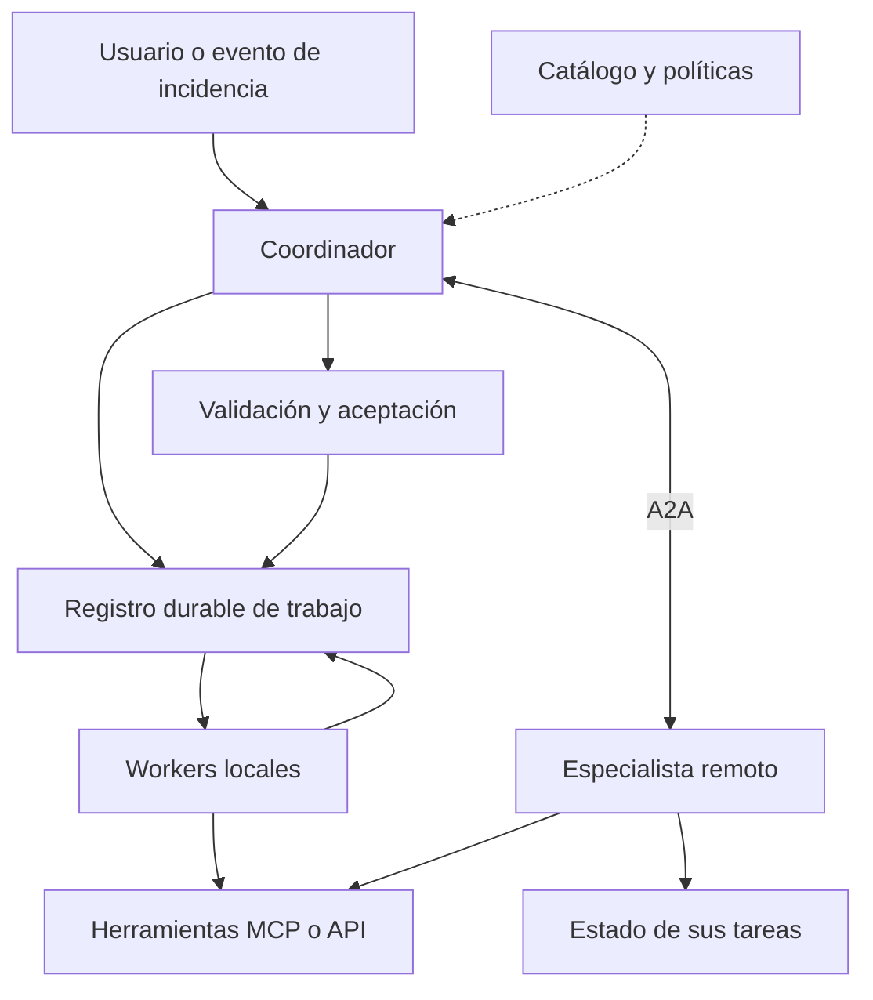
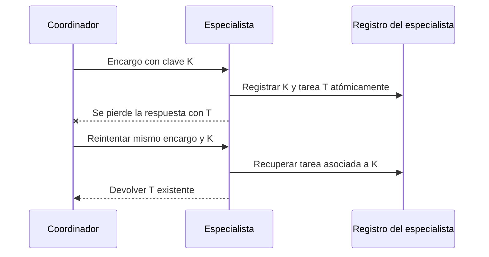

Quiero empezar a automatizar cosas con agentes y poder reutilizarlos en proyectos distintos. Un agente que investigue incidencias, otro que examine repositorios, otro que prepare documentación. Y que puedan colaborar cuando el trabajo lo requiera.

La oferta de frameworks crece tan rápido que elegir uno parece haberse convertido en el primer paso obligatorio. Mi duda empieza antes: **¿cómo se diseña un agente al que otros puedan encontrar, encargar trabajo y pedir cuentas del resultado?**

Eso me lleva a pensar en servicios, contratos y sistemas distribuidos. El framework que ejecute cada agente será una decisión dentro de esa arquitectura.

<!--truncate-->

Esta entrada reúne documentación de protocolos, patrones de ingeniería e investigación. Las fuentes están consultadas a **5 de septiembre de 2026**. La arquitectura y el experimento que propongo son un punto de partida para estudiar el problema; todavía no representan una implementación ni resultados medidos.

## 1. La unidad que quiero reutilizar

Para esta discusión, considero un agente un componente capaz de perseguir un objetivo, elegir acciones dentro de unos límites y comprobar su progreso. Publicarlo como servicio añade otras obligaciones: aceptar un encargo, mantener una identidad y devolver un resultado con un contrato reconocible.

Conviene separar tres cosas que a menudo llamamos simplemente «agente»:

| Concepto | Qué representa | Ejemplo |
| --- | --- | --- |
| Definición | Capacidad, instrucciones, herramientas permitidas y versión | Investigador de incidencias v2 |
| Ejecución | Un intento concreto de realizar trabajo | Investigar la incidencia INC-42 |
| Servicio | La interfaz por la que otros acceden a esa capacidad | Endpoint que acepta investigaciones y permite consultar su estado |

Tener cien definiciones no obliga a mantener cien procesos encendidos. Varios workers pueden ejecutar encargos bajo demanda. A la inversa, un servicio publicado podría coordinar internamente a varios agentes.

Mi criterio para separarlos sería la responsabilidad: datos diferentes, permisos diferentes, propietarios diferentes o una especialización que pueda evaluarse por separado. Cambiar el nombre del personaje en un prompt no demuestra que haga falta otro servicio.

## 2. Las decisiones pertenecen a capas distintas

| Capa | Pregunta que debe responder |
| --- | --- |
| Interoperabilidad | ¿Cómo se describen capacidades y se intercambian mensajes, tareas y resultados? |
| Contrato del dominio | ¿Qué significa investigar una incidencia y qué cuenta como un diagnóstico aceptable? |
| Coordinación | ¿Quién elige al colaborador, divide el trabajo y decide el siguiente paso? |
| Ejecución | ¿Dónde corre el trabajo y cómo continúa después de una caída? |
| Control | ¿Quién puede encargar qué, con qué datos, presupuesto y trazabilidad? |

Un protocolo compartido facilita entender la estructura de un mensaje. El significado de «diagnóstico completo» sigue necesitando un acuerdo entre las partes.

Por eso evaluaría la interoperabilidad en tres niveles: **compatibilidad del protocolo, compatibilidad del contrato y autorización para colaborar**. Un JSON válido solo resuelve una parte.

## 3. Qué aportan MCP y A2A

### MCP: capacidades accesibles desde una aplicación de IA

MCP organiza la comunicación entre un host, sus clientes y servidores que exponen herramientas, recursos y prompts. Permite incorporar capacidades externas a una aplicación de IA mediante una interfaz común. [Arquitectura de MCP](https://modelcontextprotocol.io/docs/2026-07-28/learn/architecture).

En nuestro ejemplo, un agente podría consultar logs mediante una herramienta MCP. El servidor también podría ejecutar internamente un modelo: la implementación de la herramienta no determina por sí sola qué contrato ofrece.

Además, MCP contempla operaciones prolongadas mediante la extensión Tasks, cuyo uso requiere soporte explícito de cliente y servidor. La distinción «MCP es síncrono y A2A es asíncrono» resulta insuficiente. [MCP Tasks](https://modelcontextprotocol.io/extensions/tasks/overview).

### A2A: interacción con un agente remoto

A2A describe agentes mediante una Agent Card y define mensajes, tareas y artefactos. El consumidor puede encargar trabajo sin acceder a las herramientas o al estado interno del agente remoto. [Conceptos de A2A](https://a2a-protocol.org/latest/topics/key-concepts/).

Una interacción puede devolver un mensaje inmediato o abrir una tarea con seguimiento y peticiones de información adicional. A2A tampoco exige que todo intercambio sea un trabajo largo. [Ciclo de vida de una tarea](https://a2a-protocol.org/latest/topics/life-of-a-task/).

La distinción que utilizaría al diseñar es esta:

| Encargo | Contrato que me interesa |
| --- | --- |
| «Consulta los errores de este servicio entre estas horas» | Una operación con entradas y salida delimitadas; MCP o una API pueden encajar |
| «Investiga esta incidencia y entrega un diagnóstico respaldado por evidencias» | Delegación de un objetivo con seguimiento; A2A puede encajar |

Son ejemplos de diseño, no una frontera absoluta. Publicaría la capacidad según la responsabilidad que quiero ofrecer al consumidor. Y fijaría versiones y capacidades compatibles antes de conectar implementaciones: compartir las siglas del protocolo no garantiza que dos clientes concretos funcionen juntos.

## 4. Patrones para decidir quién hace qué

Anthropic documenta encadenamiento, enrutado, paralelismo, coordinación con workers y ciclos de evaluación. Microsoft describe también handoff, conversación de grupo y planificación con un coordinador. Son referencias de diseño que pueden estudiarse sin adoptar sus frameworks. [Patrones de Anthropic](https://www.anthropic.com/engineering/building-effective-agents), [patrones de Microsoft](https://learn.microsoft.com/en-us/azure/architecture/ai-ml/guide/ai-agent-design-patterns).

Esta es mi lectura práctica de las alternativas:

| Patrón | Reparto del trabajo | Decisión que dejaría explícita |
| --- | --- | --- |
| Enrutado | Se selecciona un especialista | Qué hacer si ningún candidato encaja |
| Secuencia | Cada etapa recibe el resultado anterior | Cuándo impedir que avance una salida inválida |
| Supervisor y especialistas | Un responsable delega y reúne resultados | Quién conserva la responsabilidad del encargo original |
| Paralelismo y agregación | Varias ramas trabajan y se combinan | Cómo tratar resultados parciales o contradictorios |
| Handoff | Otro agente asume la interacción | Cuándo se considera aceptada la transferencia |
| Productor y evaluador | Una propuesta recibe revisión | Criterios de aceptación y límite de revisiones |
| Coreografía por eventos | Los participantes reaccionan a hechos | Quién comprueba que el objetivo global terminó |
| Blackboard | Se trabaja sobre un espacio de información común | Propiedad, versiones y reglas de escritura |
| Selección negociada | Los candidatos proponen condiciones | Cómo contrastar capacidad, coste y compromisos |

Los tres últimos también permiten pensar en colaboraciones menos centralizadas. Aquí los incluyo como alternativas arquitectónicas; la tabla no pretende ser una taxonomía oficial compartida por los proveedores.

### Delegar una parte y transferir el control

Si el coordinador pide a un especialista un análisis de logs, espera recuperarlo e integrarlo. Si transfiere la conversación a soporte de bases de datos, cambia quién conduce el siguiente paso. Usar el mismo mecanismo interno de llamada no elimina esa diferencia de responsabilidad.

### Paralelizar y debatir

Dos investigadores pueden examinar fuentes distintas y entregar evidencias. Si además deben conversar para alcanzar un acuerdo, aparece otro coste: rondas de comunicación, contexto compartido y un criterio de cierre.

Para investigar INC-42, empezaría con logs y cambios recientes en paralelo, seguidos de una integración. Solo introduciría debate si identifico contradicciones que esa interacción ayude a resolver.

### Coordinar mediante eventos

`InvestigarIncidencia` es una orden; `EvidenciasRecopiladas` expresa un hecho. Mantendría esa diferencia en los contratos para que quede claro quién debe actuar y qué ha sucedido.

La coreografía puede servir cuando varias automatizaciones reaccionan al mismo hecho. Aun así, conservaría un responsable del resultado de INC-42: la existencia de eventos no demuestra que alguien haya terminado el diagnóstico.

## 5. Hacer que los agentes estén disponibles

A2A contempla descubrimiento mediante una dirección conocida, configuración directa o catálogos. Su ruta convencional para una Agent Card es `/.well-known/agent-card.json`; la especificación no prescribe una API universal para los catálogos. Conocer esa ruta tampoco descubre por sí solo los dominios donde hay agentes. [Descubrimiento en A2A](https://a2a-protocol.org/latest/topics/agent-discovery/).

Para una primera red privada utilizaría un catálogo pequeño y controlado. Sobre la descripción del protocolo, guardaría datos operativos propios:

- Propietario, versión del contrato y ámbito de acceso.
- Capacidades aceptadas y ejemplos de entradas válidas.
- Evaluaciones por tipo de tarea, con fecha y versión evaluada.
- Estado operativo, límites de concurrencia y condiciones de uso.

La selección tendría dos pasos. Primero, código que filtre por permisos, compatibilidad y disponibilidad. Después, reglas o un modelo que escojan entre los candidatos válidos.

Evitaría entregar el catálogo entero en cada prompt. Para «investigar una incidencia del proyecto X», el coordinador debería recibir los pocos candidatos autorizados para ese trabajo.

También separaría la descripción relativamente estable del servicio de su salud actual. «Sé analizar logs» y «puedo aceptar trabajo ahora» son datos diferentes. Y una ficha, incluso autenticada, acredita procedencia; la calidad necesita evaluaciones.

## 6. El contrato de delegación

Aquí es donde más me interesa profundizar. Al pedir a otro agente que investigue, estoy transfiriendo capacidad de decisión. Necesito delimitarla.

Este sería un **documento de aplicación ilustrativo**, con identificadores ficticios. No es una Agent Card ni un mensaje A2A listo para enviar:

```json
{
  "contract": "incident-investigation/v1",
  "work_id": "work-42",
  "parent_work_id": "incident-42",
  "objective": "Explicar los errores del servicio checkout",
  "inputs": {
    "project": "shop-demo",
    "incident_ref": "incident:INC-42",
    "evidence_refs": ["evidence:logs-42", "evidence:deployments-42"]
  },
  "acceptance": [
    "Cada conclusión referencia evidencias",
    "Distingue hechos, hipótesis y datos ausentes"
  ],
  "authority": {
    "policy_ref": "policy:incident-read-only",
    "allowed_actions": ["logs.read", "deployments.read"]
  },
  "limits": {
    "deadline": "2026-09-05T12:10:00Z",
    "max_model_calls": 12,
    "max_delegation_depth": 1
  },
  "result_contract": "incident-diagnosis/v1",
  "idempotency_key": "shop-demo:INC-42:investigation:1"
}
```

El contrato de salida definiría al menos hallazgos, referencias de evidencia, incertidumbres y recomendaciones. Las referencias de entrada resolverían datos versionados, incluida la ventana temporal de la incidencia.

Para transportarlo sobre A2A, ambas partes tendrían que acordar su representación como datos estructurados y su versión. El identificador de trabajo del negocio y el identificador de tarea remota deben quedar relacionados, aunque no sean iguales.

Los campos de autoridad y límites expresan condiciones; **escribirlas en JSON no las hace cumplir**. El servicio valida la identidad y la política aplicable, restringe herramientas y registra el consumo. El cliente no puede concederse permisos modificando `allowed_actions`.

Definiría además quién acepta el resultado: el coordinador comprueba estructura y evidencias; una persona interviene si la decisión posterior requiere su aprobación. Los permisos de investigación no autorizan automáticamente una reparación.

## 7. Una arquitectura inicial que pueda ponerse a prueba

Para el caso de incidencias, propondría estas responsabilidades:



Es una propuesta propia. Las cajas representan responsabilidades y pueden compartir aplicación o base de datos en una primera implementación.

El registro local conserva el encargo, sus dependencias y las referencias a tareas remotas. Cada servicio remoto conserva el estado que expone a través de su contrato. Así puedo consultar una investigación después de reiniciar el coordinador, sin necesitar acceso a la base de datos del especialista.

Para distribuir trabajo entre workers, una cola durable es una opción conocida. También podría empezar con una tabla de trabajos reclamados de forma atómica y una concesión temporal que permita recuperarlos cuando el worker desaparezca. La elección depende de la concurrencia y las garantías que necesite. [Patrón Competing Consumers](https://learn.microsoft.com/en-us/azure/architecture/patterns/competing-consumers).

El primer flujo sería concreto: recibir INC-42, autorizarla, recopilar logs y despliegues, integrar las evidencias y validar el diagnóstico. La planificación con un modelo solo entraría donde el siguiente paso dependa realmente de lo que se descubra.

## 8. Qué sucede cuando la ejecución se tuerce

### Un timeout deja incertidumbre

Supongamos que el especialista acepta el trabajo y se pierde su respuesta. El coordinador no sabe si la operación llegó. Repetirla sin más puede crear dos investigaciones o duplicar un efecto externo.

A2A permite que las operaciones de envío sean idempotentes, pero no impone esa garantía a todos los agentes. Por tanto, la política de deduplicación debe acordarse y verificarse. [Semántica de idempotencia en A2A](https://a2a-protocol.org/latest/specification/#331-idempotency).

Mi contrato exigiría reutilizar una clave para la misma operación lógica, rechazar su reutilización con un contenido distinto y permitir recuperar la tarea asociada. Cuando el remoto no ofrezca esa garantía, el coordinador debe conservar la incertidumbre y reconciliar el estado antes de repetir una acción con efectos.



Este diagrama representa una garantía adicional pactada en mi aplicación. Para un efecto externo, la deduplicación también debe llegar al sistema que realiza ese efecto. Registrar una clave en el coordinador no garantiza ejecución única de extremo a extremo.

### Cancelar y recuperarse requieren reglas

Definiría si cancelar el trabajo padre cancela sus subtareas, qué ocurre si un remoto no responde y cómo registrar un resultado que llegue tarde. Cancelar una ejecución tampoco deshace automáticamente una acción ya realizada.

Separaría los intentos de ejecución del encargo del negocio. En A2A, una tarea terminal no se reinicia: un nuevo trabajo relacionado necesita otra tarea. El registro local puede conservar la relación entre ambas. [Inmutabilidad de tareas A2A](https://a2a-protocol.org/latest/topics/life-of-a-task/).

Los presupuestos también deben ser compartidos. Si el padre autoriza doce llamadas, los hijos reciben porciones de ese límite; asignar doce a cada uno multiplica el presupuesto. Reservaría capacidad antes de lanzar ramas paralelas.

Y mantendría separados dos estados: ejecución terminada y resultado aceptado. Un diagnóstico puede llegar correctamente y carecer de evidencia suficiente. En ese caso debe quedar rechazado o pendiente de revisión, no convertirse en una certeza por haber finalizado la tarea.

## 9. Contexto, memoria y autoridad

Para esta arquitectura distinguiría el historial de conversación, el estado de ejecución, las evidencias y la memoria reutilizable. Cada uno tiene distinta vida útil y distintos permisos.

Al delegar enviaría un objetivo, un resumen acotado y referencias autorizadas. Cada hallazgo conservaría su fuente, instante y versión. Si dos investigadores discrepan, guardaría ambas observaciones hasta resolver la contradicción; sobrescribir una con la otra pierde información.

Un blackboard podría ser ese espacio compartido de evidencias e hipótesis. No necesita empezar como una base vectorial: necesita reglas de acceso, procedencia y actualización.

En cuanto a identidad, distinguiría al usuario que solicita el trabajo, al servicio que llama y a la operación autorizada. La documentación de seguridad de MCP advierte específicamente sobre aceptar y reenviar tokens destinados a otros servicios. Encadenar agentes no convierte una credencial en universal. [Seguridad de MCP](https://modelcontextprotocol.io/docs/2026-07-28/tutorials/security/security_best_practices).

Mi regla operativa sería que cada delegación conserve o reduzca la autoridad disponible. Los documentos, logs y respuestas de otros agentes se tratan como datos potencialmente no fiables: su contenido no puede modificar las políticas del ejecutor. Un mensaje que sugiera «reinicia producción» sigue necesitando una autorización válida para esa operación.

## 10. Qué está estudiando la investigación

Tres referencias ayudan a convertir estas decisiones en preguntas comprobables:

| Trabajo | Tipo de evidencia | Qué aporta y qué no demuestra |
| --- | --- | --- |
| [Towards a Science of Scaling Agent Systems](https://research.google/blog/towards-a-science-of-scaling-agent-systems-when-and-why-agent-systems-work/) | Evaluación de 180 configuraciones | Encuentra ventajas en tareas paralelizables y degradación en ciertos trabajos secuenciales. Sus resultados dependen de tareas, modelos y configuraciones; no establecen un número universal de agentes. |
| [Why Do Multi-Agent LLM Systems Fail?](https://arxiv.org/abs/2503.13657) | Análisis de fallos y taxonomía MAST | Distingue problemas de diseño, desalineación entre agentes y verificación. Ayuda a clasificar errores; no es una receta que garantice eliminarlos. |
| [Intelligent AI Delegation](https://arxiv.org/abs/2602.11865) | Propuesta conceptual de delegación | Incorpora autoridad, responsabilidad, límites y confianza al reparto de trabajo. Es investigación, no un protocolo aprobado ni una arquitectura validada para cualquier negocio. |

De estas lecturas saco una agenda propia de experimentación: selección de colaboradores basada en evidencia, coordinación adaptada a la tarea y validación independiente del resultado. Es mi interpretación de cómo estudiar el sistema, no una conclusión conjunta publicada por esos autores.

La revisión merece atención especial. Dos agentes pueden compartir modelo, fuentes y supuestos, y coincidir en un error. Para comprobar una afirmación sobre INC-42, preferiría contrastarla con los logs originales y reglas verificables. Añadir una segunda opinión puede ayudar, pero su utilidad también se mide.

## 11. El experimento con el que empezaría

Prepararía un conjunto de incidencias históricas anonimizadas o sintéticas, con evidencias congeladas y criterios de evaluación definidos antes de ejecutar las pruebas. Incluiría casos con información insuficiente, para que el sistema pueda acertar al reconocer que todavía no sabe.

Compararía estas variantes:

1. Un agente con las herramientas necesarias.
2. Un coordinador con dos especialistas: logs y cambios recientes.
3. La misma colaboración, añadiendo un evaluador del diagnóstico.

Mantendría el mismo acceso a fuentes y límites totales comparables, registraría versiones de modelos y repetiría los casos. Mediría diagnósticos respaldados por evidencia, afirmaciones incorrectas, coste por resultado aceptado, latencia y necesidad de intervención humana.

También provocaría fallos: perder una respuesta después de aceptar el encargo, reiniciar un worker, duplicar una entrega, cancelar durante la ejecución y presentar evidencias contradictorias. Ese ensayo comprueba propiedades que una demostración del camino feliz deja fuera.

Incorporaría otro agente cuando los resultados mostrasen una mejora útil o necesitase una frontera real de responsabilidad. Publicaría sus capacidades, contrato y condiciones de uso junto con las limitaciones observadas.

Lo que quiero construir es una colección de capacidades reutilizables: poder encargarles trabajo, seguirlo durante sus fallos y decidir con evidencias si el resultado merece aceptarse. A partir de ahí, sí tiene sentido empezar a crear agentes por un tubo.
