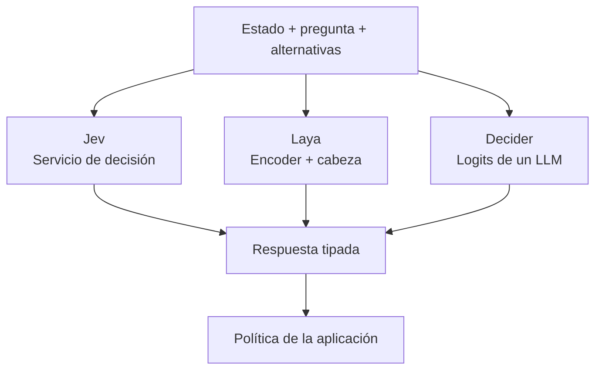
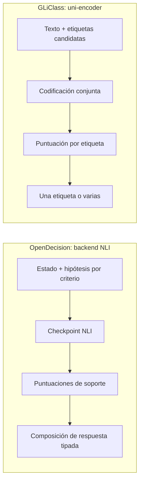
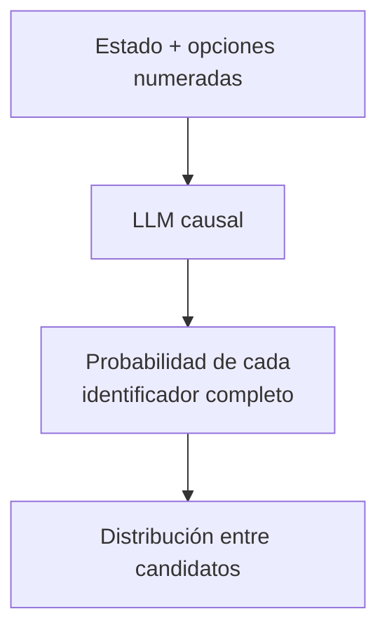
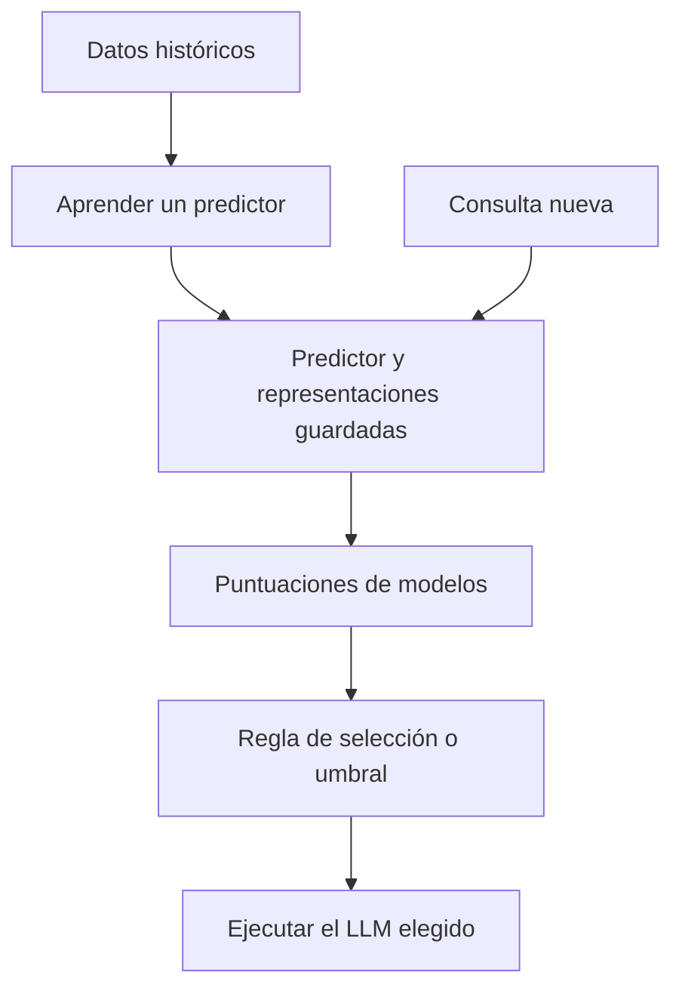
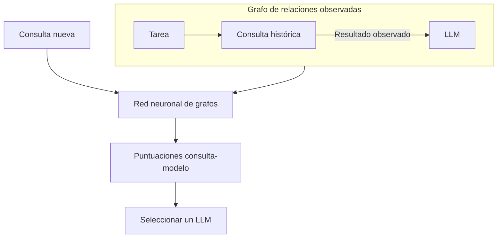
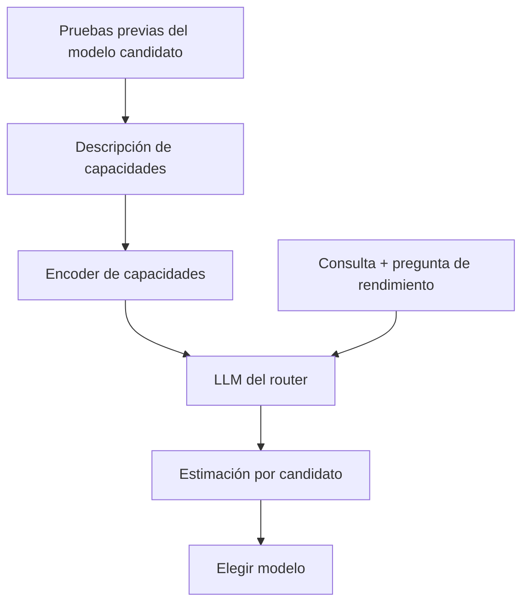
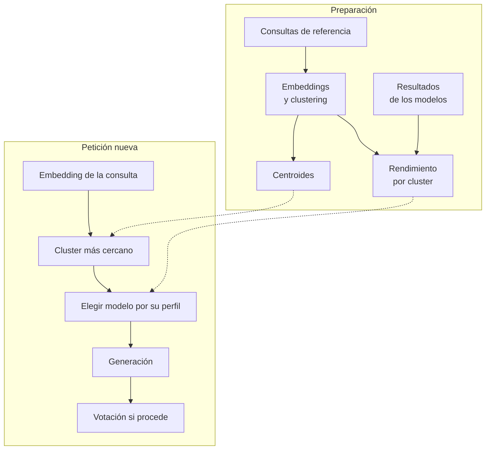
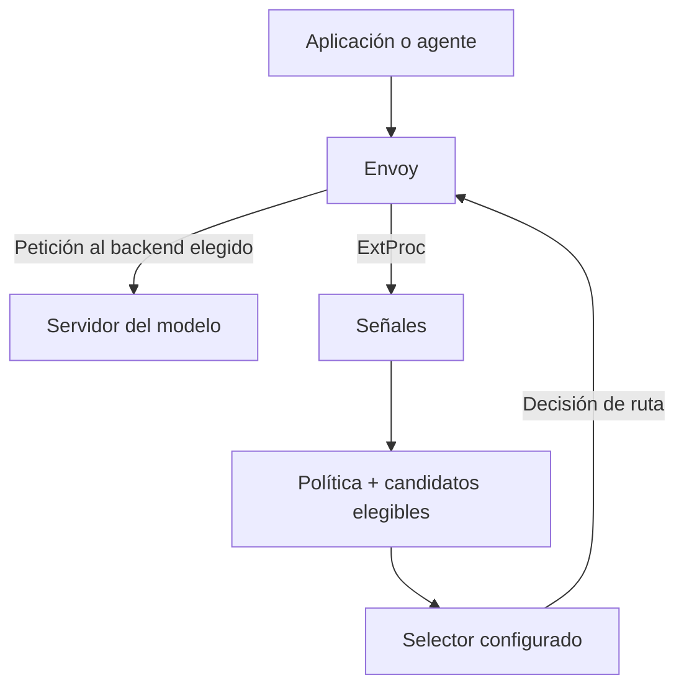
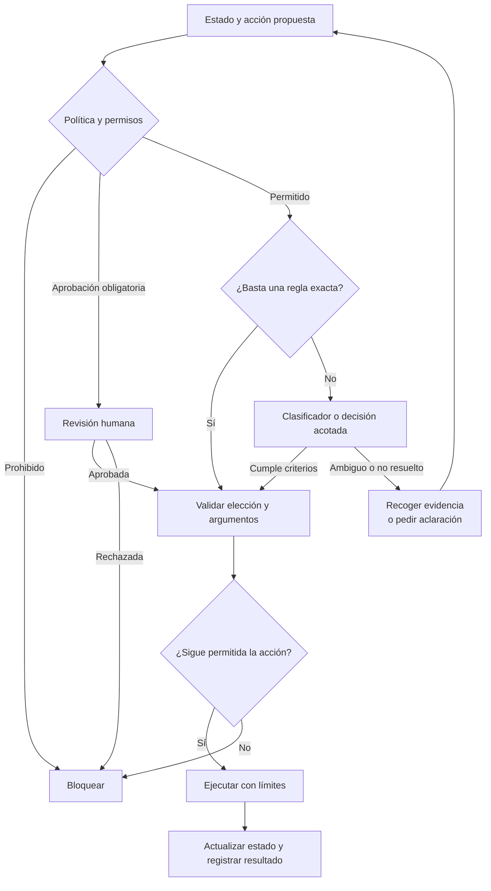

He estado investigando qué decisiones de un agente de programación merecen una llamada generativa y cuáles pueden resolverse con un mecanismo más pequeño. Elegir una herramienta, comprobar una afirmación o escalar una tarea son problemas diferentes de escribir el parche que la resuelve. Mi propuesta es repartir ese trabajo entre código, clasificadores, modelos de decisión y LLM, y medir si esa separación mejora el resultado.

<!--truncate-->

## Clasificar, decidir y razonar

**Clasificar** asigna etiquetas: `bug`, `documentación` o `posible_inyección`. **Decidir** incorpora objetivos y restricciones para elegir una acción: leer un archivo, pedir contexto o escalar a otro modelo. **Razonar** permite construir una explicación, un diagnóstico o un plan a partir de evidencia.

Son funciones que se pueden combinar. Un clasificador puede aportar la señal para una decisión; la política determina qué hacer con ella. Además, una salida cerrada puede requerir razonamiento: responder «sí» a una pregunta matemática difícil no la convierte en una tarea sencilla.

Por eso separo dos preguntas: **qué salida necesita el software** y **qué capacidad hace falta para obtenerla**. Un contrato tipado describe la primera; la evaluación de la tarea debe resolver la segunda.

## Cuándo compensa evitar otra generación

Si el arnés llama al LLM principal para planificar y después hace otra llamada solo para escoger entre `search`, `read_file` y `run_tests`, añade procesamiento de contexto, generación y validación de la respuesta. Una salida estructurada puede reducir errores de formato. El coste de inferencia y los errores semánticos siguen existiendo.

Un encoder o un modelo dedicado puede puntuar opciones sin producir una secuencia de texto libre. Eso puede reducir latencia y coste, especialmente en decisiones repetidas. Hay que medir también red, carga del modelo, longitud de contexto, reintentos y recuperación de decisiones incorrectas.

Antes de añadir un modelo, comprobaría si basta el código: un permiso denegado, un código de salida o un límite de presupuesto no necesitan inferencia. También distinguiría una decisión nueva del tool calling que el LLM ya produce durante su turno: añadir un clasificador encima de cada llamada existente puede duplicar trabajo.

## El mapa: mismo resultado, técnicas distintas

En la tabla resumo el mecanismo documentado, sin asumir que compartir una API implique compartir arquitectura o calidad. Los gráficos siguientes son esquemas explicativos del artículo; no representan resultados de un benchmark.

| Proyecto | Técnica o contrato | De dónde sale la señal |
| --- | --- | --- |
| [Jev](https://docs.typesafe.ai/introduction) | API de decisiones tipadas; arquitectura interna no detallada aquí | Estado, preguntas y opciones explícitas |
| [Laya](https://github.com/NandhaKishorM/laya) | Encoder con cabeza de decisión | Representaciones de estado y opciones; entrenamiento y calibración |
| [Decider de Mapika](https://github.com/Mapika/decider) | Variantes de LLM con lectura de logits de opciones | Probabilidades restringidas a respuestas válidas |
| [GLiClass](https://arxiv.org/abs/2508.07662) | Clasificación zero-shot; variante principal uni-encoder | Texto y etiquetas procesados conjuntamente |
| [OpenDecision / ModernBERT](https://deepanwadhwa.github.io/OpenDecision/model-selection/) | Adaptación de un checkpoint NLI a decisiones tipadas | Soporte de hipótesis construidas desde criterios |
| [LLM2Jev](https://arxiv.org/abs/2610.02076) | Lectura de probabilidades de identificadores numéricos | Un LLM existente, con receta sin entrenamiento o ajuste fino |
| [RouteLLM](https://arxiv.org/abs/2406.18665) | Familia de routers de preferencias | Comparaciones de respuestas entre modelos |
| [RouterDC](https://arxiv.org/abs/2409.19886) | Aprendizaje contrastivo dual | Rendimiento por consulta y agrupación de consultas |
| [EmbedLLM](https://arxiv.org/abs/2410.02223) | Representaciones compactas de modelos | Matriz de aciertos por modelo y pregunta |
| [GraphRouter](https://arxiv.org/abs/2410.03834) | Grafo heterogéneo y predicción de aristas | Relaciones entre tareas, consultas y LLM |
| [Model-SAT](https://arxiv.org/abs/2502.17282) | Perfil de capacidades y capability instruction tuning | Resultados de pruebas de aptitud de cada modelo |
| [The Avengers](https://arxiv.org/abs/2505.19797) | Clustering, perfiles de rendimiento y votación | Evaluación previa por grupo de consultas |
| [vLLM Semantic Router](https://github.com/vllm-project/semantic-router) | Capa de señales, políticas y selección | Clasificadores, configuración y selector elegido |

### 1. Jev, Laya y Decider: el contrato tipado

El contrato público de Jev distingue `Choice`, `Score` y `Noul`: elección entre opciones, posición en una escala descrita y probabilidad de sí. Ese contrato puede resultar útil para varios mecanismos internos; la documentación de la API no permite deducir que Jev use el mismo encoder o la misma cabeza que otro proyecto.

*Figura 1. Un contrato parecido puede envolver implementaciones diferentes. Jev se muestra como servicio, sin inventar su arquitectura interna.*

Laya utiliza encoders: ModernBERT en checkpoints de inglés y mmBERT en el multilingüe. Las variantes de Decider basadas en Qwen leen los logits en posiciones de respuesta y los normalizan sobre opciones válidas. En ambos casos hay que identificar checkpoint, runtime y calibración para comparar resultados. Fuentes: [Laya](https://github.com/NandhaKishorM/laya) y [mecanismo de Decider](https://github.com/Mapika/decider#how-it-works).

Aquí `Decider` se refiere a Mapika. [Strands Decider](https://github.com/strands-labs/strands-decider) es otro proyecto; conviene distinguirlos al comparar implementaciones.

### 2. GLiClass y OpenDecision: dos caminos de clasificación

La variante uni-encoder de GLiClass procesa juntas las etiquetas y el texto y calcula puntuaciones por etiqueta. En clasificación multietiqueta pueden activarse varias; no hay que forzar siempre una única ganadora. El proyecto también contempla otras variantes. Fuentes: [paper](https://arxiv.org/abs/2508.07662) y [código](https://github.com/Knowledgator/GLiClass).

OpenDecision utiliza por defecto `MoritzLaurer/ModernBERT-large-zeroshot-v2.0`. Convierte criterios en consultas NLI: si una hipótesis está respaldada por el estado. La envoltura puede reformular y repetir consultas; evitar generación libre no garantiza resolver toda la decisión en una sola pasada. Fuente: [selección y evaluación del backend](https://deepanwadhwa.github.io/OpenDecision/model-selection/).

*Figura 2. Clasificar texto con etiquetas y evaluar hipótesis de soporte son operaciones relacionadas, con formulaciones diferentes.*

**ModernBERT es una familia de encoders**, no una API de decisión ni un clasificador zero-shot listo para cualquier tarea. La capacidad concreta depende del checkpoint y de su ajuste. Asimismo, *zero-shot* significa usar etiquetas o tareas nuevas sin ejemplos específicos en esa llamada; el modelo sí ha sido entrenado. Fuente: [paper de ModernBERT](https://aclanthology.org/2025.acl-long.127/).

### 3. LLM2Jev: usar el LLM como lector de opciones

Este preprint puntúa las continuaciones de identificadores como `1]` o `10]` desde un prefijo compartido. Combina probabilidades de tokens para comparar candidatos completos; no basta con mirar solo el primer token cuando dos identificadores lo comparten. Propone una receta sin entrenamiento y otra de ajuste fino. Fuente: [LLM2Jev](https://arxiv.org/abs/2610.02076).

*Figura 3. La lectura se limita a continuaciones candidatas; el coste depende también de su tokenización.*

Si tienes acceso a las probabilidades del modelo, esta técnica permite reutilizarlo para decidir. Una API de chat no siempre expone lo necesario. Compartir pesos tampoco elimina el procesamiento del contexto ni garantiza el ahorro: hay que medir la implementación utilizada.

### 4. RouteLLM, RouterDC y EmbedLLM: aprender a puntuar modelos

Estos proyectos necesitan evidencia previa sobre modelos y consultas. Durante el routing de una petición nueva, el predictor estima puntuaciones sin pedir primero una respuesta completa a todos los generadores candidatos.

*Figura 4. Se separan la preparación del router y la ejecución de cada petición; las técnicas de aprendizaje difieren.*

**RouteLLM** compara preferencias entre respuestas y ofrece varios routers. La factorización matricial es una de sus variantes, junto con clasificadores y ranking por similitud. Un umbral controla cuándo recurrir al modelo más potente. Fuentes: [paper](https://arxiv.org/abs/2406.18665) y [repositorio](https://github.com/lm-sys/RouteLLM).

**RouterDC** aprende un encoder de consultas y embeddings de modelos con dos objetivos contrastivos: consulta–LLM y consulta–consulta. El primero acerca consultas a modelos que rindieron bien; el segundo organiza consultas según sus grupos. Fuentes: [paper](https://arxiv.org/abs/2409.19886) y [código](https://github.com/shuhao02/RouterDC).

**EmbedLLM** aprende representaciones compactas a partir de una matriz de aciertos modelo–pregunta. Esas representaciones sirven después para predecir rendimiento y seleccionar modelos. Sus vectores son representaciones aprendidas del comportamiento; no son simplemente el embedding del nombre comercial del LLM. Fuentes: [paper](https://arxiv.org/abs/2410.02223) y [código](https://github.com/richardzhuang0412/EmbedLLM).

### 5. GraphRouter: aprender las relaciones del grafo

GraphRouter introduce nodos de tareas, consultas y LLM. Una red neuronal de grafos usa las relaciones observadas y estima la puntuación de aristas consulta–modelo, teniendo en cuenta rendimiento y coste. Fuentes: [paper](https://arxiv.org/abs/2410.03834) y [implementación pública](https://github.com/ulab-uiuc/GraphRouter).

*Figura 5. Esquema conceptual del grafo y su predictor; una arista observada no implica ejecutar ese modelo para cada consulta nueva.*

### 6. Model-SAT: construir un perfil de capacidades

Model-SAT obtiene descripciones de capacidad a partir de pruebas de aptitud, las codifica y las combina con la consulta en un LLM pequeño para predecir si un candidato podrá resolverla. Requiere entrenamiento del router y evaluación previa del candidato; una descripción escrita a mano de «modelo bueno para código» no reproduce el método. Fuente: [paper](https://arxiv.org/abs/2502.17282).

*Figura 6. Las capacidades se miden antes; el generador seleccionado resuelve la petición después.*

El paper enlaza un repositorio de código, pero no pude verificar su contenido durante esta revisión. El mecanismo descrito aquí se apoya en el artículo.

### 7. The Avengers: agrupar consultas y medir especialistas

Avengers prepara clusters de consultas y perfiles de rendimiento por modelo y cluster. Una petición nueva se asigna al grupo más cercano y se elige el modelo según el perfil. Puede añadir muestreo repetido y votación. Evita entrenar un router neuronal adicional, pero necesita datos evaluados para construir los perfiles. Fuentes: [paper](https://arxiv.org/abs/2505.19797) y [código](https://github.com/ZhangYiqun018/Avengers).

*Figura 7. El trabajo previo hace posible una selección sencilla en ejecución.*

La votación exige respuestas comparables. En programación, varios textos o parches coincidentes no prueban corrección: deben validarse con criterios de la tarea y pruebas ejecutables. El paper también distingue el tratamiento de sus tareas de código.

### 8. vLLM Semantic Router: conectar señales, políticas y servicio

vLLM Semantic Router combina detección de señales, políticas, candidatos elegibles y algoritmos de selección. Envoy maneja el tráfico y los backends generan respuestas. La técnica concreta depende del selector y de los modelos configurados; no hay un único «modelo vLLM Semantic Router» cuya calidad resuma todo el sistema. Fuente: [arquitectura del proyecto](https://github.com/vllm-project/semantic-router/blob/main/website/docs/overview/semantic-router-overview.md).

*Figura 8. La decisión semántica y el transporte tienen responsabilidades distintas.*

El cliente sigue siendo responsable de su estado y de ejecutar sus herramientas. Filtrar el catálogo no ejecuta las herramientas ni concede permisos.

## Dónde encaja cada técnica en un agente de programación

| Uso | Ejemplo concreto | Mecanismo que evaluaría |
| --- | --- | --- |
| Selección de herramientas | Reducir un catálogo grande a herramientas relevantes | Recuperación semántica o GLiClass; decisión tipada para la selección final |
| Guardrails | Señalar instrucciones sospechosas en un archivo recuperado | Clasificador especializado; política y permisos en código |
| Escalado | Pedir contexto o cambiar de nivel de capacidad | Choice/Noul, con alternativa de abstención |
| Evaluador barato | Contrastar si la explicación del agente está respaldada por el diff y la salida de herramientas | NLI o pregunta tipada con evidencia acotada |
| Siguiente acción | Elegir entre inspeccionar, probar, corregir o terminar | Decisión tipada sobre estado y acciones elegibles |
| Routing de modelos | Escoger el generador para el siguiente turno | Router con datos de resultados propios y restricciones de coste/capacidad |

Esta tabla propone aplicaciones para evaluar; no afirma que cada proyecto haya demostrado todos esos usos en coding agents.

Para el **evaluador barato**, leer un código de salida o detectar una ruta protegida debe seguir siendo código determinista. El modelo aporta algo cuando hay interpretación semántica, como comprobar si una afirmación del resumen está respaldada por evidencia. Su aceptación no sustituye a ejecutar pruebas ni a revisar el cambio.

En el **controlador de acciones**, el arnés tiene que ofrecer opciones pertinentes, conservar el estado y limitar reintentos. Una decisión tipada sobre un menú obsoleto puede entrar en bucle. Un plan nuevo o una condición de carrera desconocida requiere que el agente reúna evidencia y reformule el problema.

En **model routing**, dificultad percibida y rendimiento real son señales diferentes. Clasificar una tarea como «compleja» no demuestra qué modelo resolverá mejor esa tarea. Además, cambiar de proveedor a mitad de un bucle puede alterar esquemas de herramientas, estado de conversación o cachés; hay que validar la continuidad del agente.

## La arquitectura que empezaría a construir

Mantendría la autorización y la ejecución en el runtime. Primero resolvería reglas exactas y decisiones deterministas; después usaría inferencia para las preguntas semánticas pendientes. La revisión humana obligatoria debe cumplirse aunque el modelo devuelva una puntuación alta.

*Figura 9. Una señal del modelo no salta las reglas de autorización; el ejecutor vuelve a comprobarlas sobre la acción concreta.*

Empezaría en **shadow mode**: registrar decisiones propuestas sin cambiar el comportamiento. Después activaría una decisión de bajo riesgo con timeout, validación y fallback explícito. Si falla un router de coste, puede conservarse el modelo actual; si falla un control de una acción sensible, puede corresponder detenerse o pedir revisión. El fallback depende de la decisión.

## Qué medir y qué no confundir

Hay tres comprobaciones diferentes: que la salida cumpla el esquema, que la decisión sea acertada y que aplicarla mejore la tarea completa. Pasar la primera no demuestra las otras dos.

Usaría ejemplos representativos y reservados, con criterios revisados. Para routing, evaluaría resultados pareados de los candidatos —o una muestra acordada— y compararía contra el modelo fijo, una regla sencilla y una selección aleatoria bajo presupuesto equivalente. Registraría calidad final, tiempo, coste por tarea completada, fallos y escalados, incluyendo el coste del router y los reintentos.

Las probabilidades necesitan comprobarse con datos etiquetados. También mediría qué proporción de casos se automatiza y cuántos errores quedan entre los aceptados. Un sistema que abstiene siempre puede parecer fiable y aportar poco.

En Jev, `Choice` y `Score` incluyen `confidence`, calculada como un resumen de la distribución; no es simplemente `max(probabilities)`. `Noul` devuelve la probabilidad de sí sin ese campo separado. No trasladaría umbrales entre proyectos sin revisar su definición y calibración. Fuente: [documentación de confianza](https://docs.typesafe.ai/confidence).

Otros límites que mantendría visibles:

- **Opciones y redacción.** Cambiar nombres, descripciones, orden o número de candidatos puede cambiar la predicción. Probaría esas variaciones y los casos que no encajan en ninguna opción.
- **Estado e idioma.** El recorte de contexto y el checkpoint elegido pueden eliminar la evidencia necesaria. La longitud y el idioma deben formar parte de la evaluación.
- **Seguridad.** El texto recuperado puede contener instrucciones maliciosas; devolver una etiqueta tipada no evita que influyan en la decisión.
- **Especialización.** Un encoder rápido en una tarea conocida puede fallar ante preguntas nuevas. En Jev, el propio proveedor documenta límites en aritmética, fechas, indirección y estados con información irrelevante: [limitaciones de Jev 1.13](https://docs.typesafe.ai/model-jaggedness/jev-1.13).
- **Evidencia y versiones.** Comparar benchmarks con distintos modelos, datasets o criterios no produce un ranking fiable. Evitaría ajustar sobre el test y conservaría versiones de modelo, prompts y política.
- **Madurez.** Hay papers, preprints, APIs comerciales y repositorios comunitarios en esta lista. Esta revisión documental no ejecuta sus benchmarks ni certifica que un proyecto sea apto para producción.

## Qué me llevo del estudio

Me interesa una arquitectura en la que el código resuelva reglas exactas, los modelos pequeños aporten juicios acotados y el generador tenga espacio para investigar y escribir. El contrato debe dejar claro qué se está prediciendo y cómo se usará esa señal.

La decisión de incorporar cualquiera de estas técnicas debería salir de una mejora medida en las tareas del agente. La salida tipada facilita integrarla; su precisión, su coste total y las consecuencias de sus errores determinan si compensa.

## Papers y proyectos

Fuentes consultadas el **4 de octubre de 2026**. Los enlaces explican los mecanismos; los gráficos anteriores son esquemas propios basados en ellos.

- **Decisiones tipadas:** [Jev: documentación oficial](https://docs.typesafe.ai/introduction), [Laya](https://github.com/NandhaKishorM/laya), [Decider de Mapika](https://github.com/Mapika/decider).
- **Clasificación:** [GLiClass: paper](https://arxiv.org/abs/2508.07662) y [código](https://github.com/Knowledgator/GLiClass); [OpenDecision](https://github.com/deepanwadhwa/OpenDecision); [ModernBERT: paper](https://aclanthology.org/2025.acl-long.127/).
- **Lectura de probabilidades:** [LLM2Jev: preprint](https://arxiv.org/abs/2610.02076).
- **Routers aprendidos:** [RouteLLM: paper](https://arxiv.org/abs/2406.18665) y [código](https://github.com/lm-sys/RouteLLM); [RouterDC: paper](https://arxiv.org/abs/2409.19886) y [código](https://github.com/shuhao02/RouterDC); [EmbedLLM: paper](https://arxiv.org/abs/2410.02223) y [código](https://github.com/richardzhuang0412/EmbedLLM).
- **Grafos y perfiles:** [GraphRouter: paper](https://arxiv.org/abs/2410.03834) y [código](https://github.com/ulab-uiuc/GraphRouter); [Model-SAT: paper](https://arxiv.org/abs/2502.17282).
- **Clustering:** [The Avengers: paper](https://arxiv.org/abs/2505.19797) y [código](https://github.com/ZhangYiqun018/Avengers).
- **Servicio y políticas:** [vLLM Semantic Router](https://github.com/vllm-project/semantic-router).
